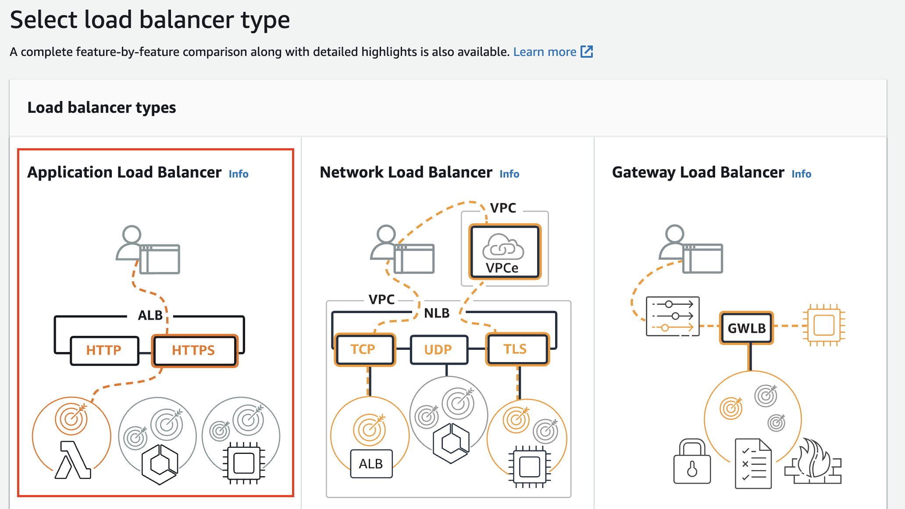
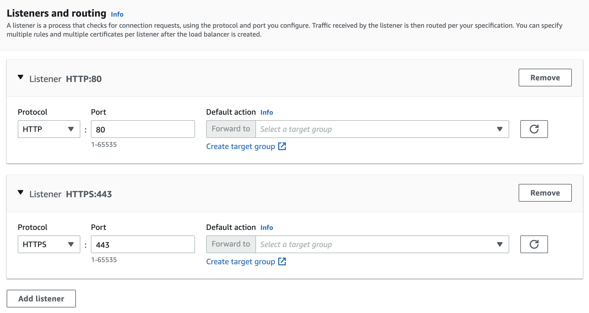
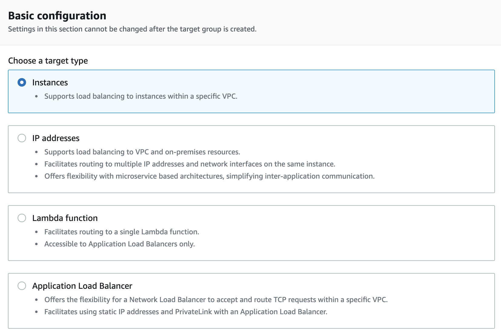
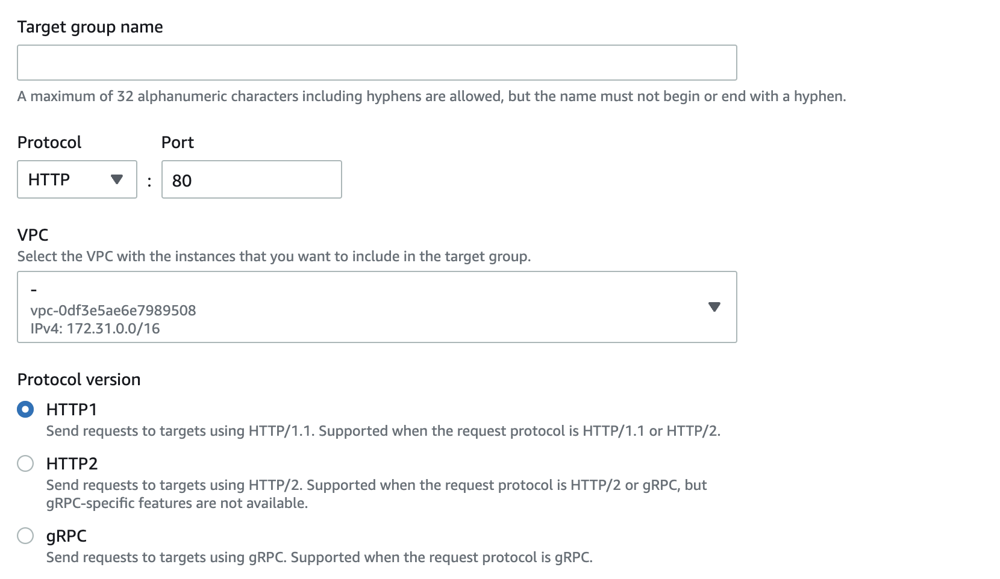
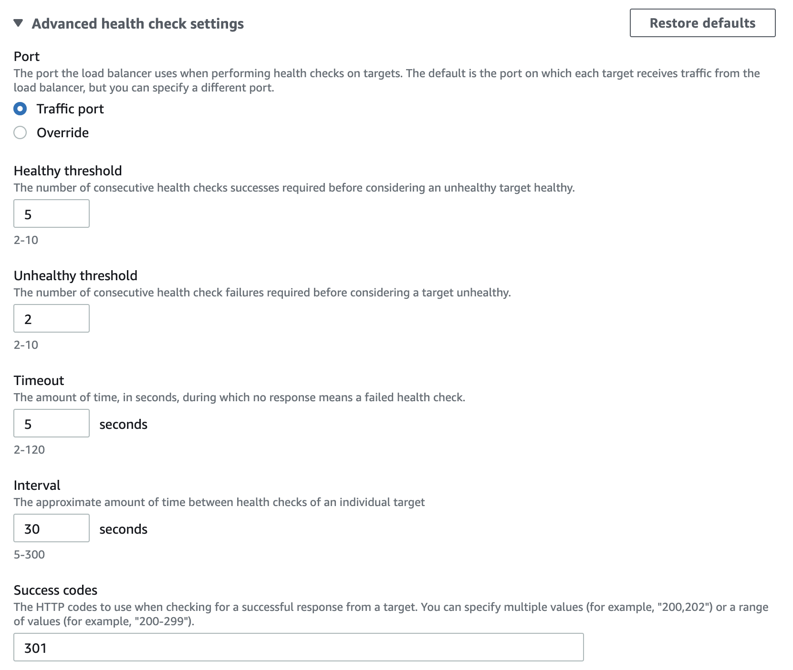
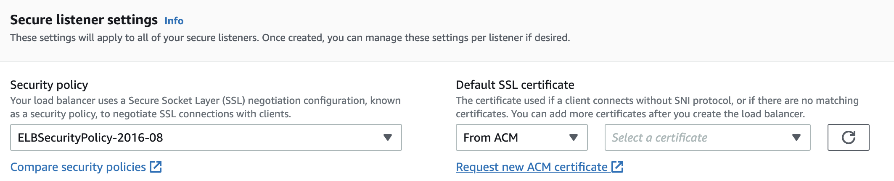
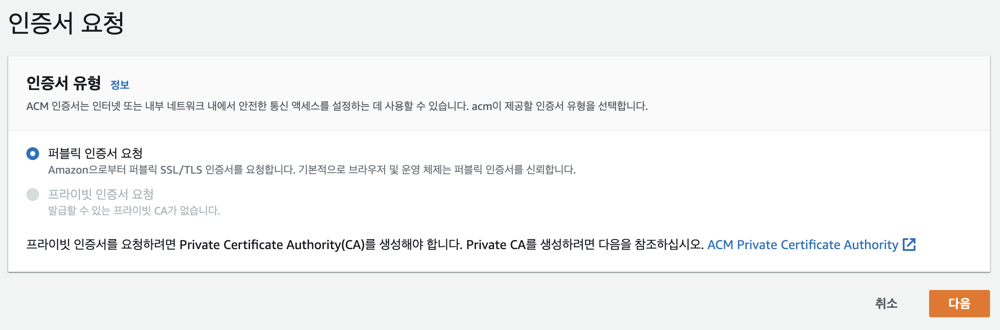
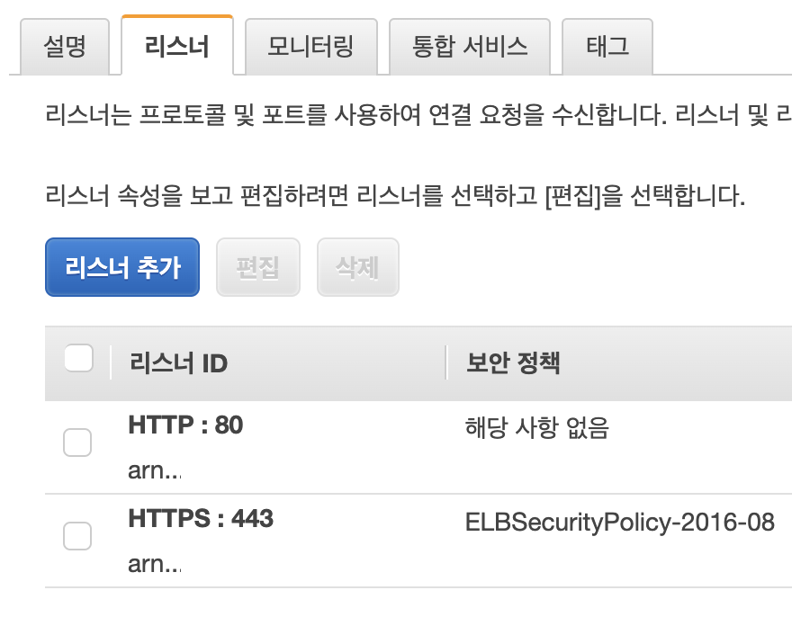
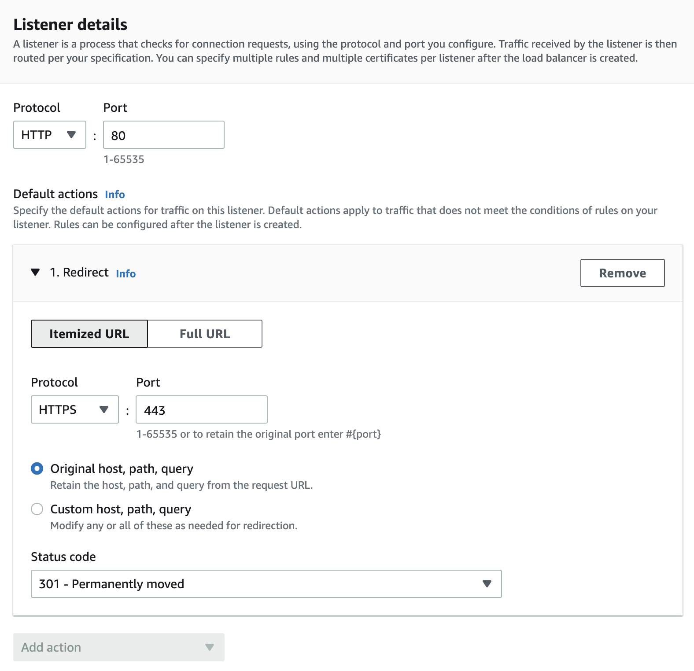

### Contents
- [개요](#개요)
- [로드 밸런서 생성](#로드-밸런서-생성)
- [Certificate Manager 인증서 요청](#Certificate-Manager-인증서-요청)
- [http 요청을 https로 리다이렉트하기](#http-요청을-https로-리다이렉트하기)
- [References](#references)

## 개요

단일 서버로만 구성된 프로젝트에는 [Let's Encrypt](https://letsencrypt.org/ko/) 를 이용해 SSL 인증서를 발급 및 적용해왔는데,

이번 프로젝트에는 AWS 환경에서 [ELB](https://aws.amazon.com/ko/elasticloadbalancing/) 를 연결해서 [Certificate Manager](https://aws.amazon.com/ko/certificate-manager/) 인증서로 https 환경을 구성해보기로 했다.

## 로드 밸런서 생성

**AWS EC2 > 로드 밸런싱 > 로드밸런서**에서 **로드 밸런서 생성**을 클릭한다.

로드밸런서 타입 선택 화면이 보이면 좌측의 **Application Load Balancer**를 선택한다.

로드밸런서 이름, VPC, 네트워크 매핑 등 기본 설정을 해준다.

**리스너와 라우팅** 설정 부분이 중요한데, 리스너를 추가하려면 설정된 경로(프로토콜, 포트)로 요청이 들어왔을 때 리스너가 포워딩해 줄 타겟 그룹을 만들어야 한다.

하위의 **Create target group** 링크를 눌러 타겟 그룹을 생성하러 가보자.

## 타겟 그룹 생성

타겟 그룹 생성 페이지에서 타겟 유형은 **인스턴스**를 선택했다.

대상 인스턴스는 80번 포트로 연결되어 있기 때문에 HTTP:80으로 설정한다.

필자는 로드밸런서를 설정하면 http로 들어오면 https로 리다이렉트할 계획이기 때문에, **Health checks > Advanced health check settings**에서 **Success codes**를 301번으로 설정했다.

**Secure listener settings**에서는 SSL 인증서를 연결해주어야 한다.

우측 하단의 **Request new ACM certificate** 링크를 눌러 SSL 인증서를 발급하러 가자.

## Certificate Manager 인증서 요청

**AWS Certificate Manager > 요청** 버튼을 클릭하고 퍼블릭 인증서 요청을 해보자.

도메인 이름을 작성하고 해당 도메인 소유를 검증할 수 있는 방법을 DNS와 이메일 중에 선택한다.

검증이 완료되면 **발급됨** 상태가 된다.

인증서 발급이 완료되면 타겟 그룹 설정 페이지로 돌아와 방금 만든 ACM을 선택하고 다음 버튼을 누른다.

**Register Targets** 페이지에서 연결할 인스턴스를 80번 포트로 등록한다.

## http 요청을 https로 리다이렉트하기

이제 로드밸런서 생성 페이지로 돌아와 생성한 타겟 그룹을 http/https 리스너에 모두 연결해주고 로드밸런서 생성을 마친다.

로드 밸런서 페이지에서 생성한 로드 밸런서를 체크하고 하위의 리스너 탭을 클릭한다.

http로 요청이 들어오면 https로 리다이렉트 되도록 설정해보자.

**https:443** 리스너를 선택하고 **편집** 버튼을 클릭해서 다음과 같이 설정해준다.

이제 다시 로드 밸런서 페이지로 돌아와 설명 탭에서 DNS 이름을 복사한 후, 도메인 관리 사이트에서 해당 도메인의 A레코드 혹은 CNAME에 값을 업데이트 해주면 끝이다.

https 환경을 구성하는 것도 설계를 어떻게 하느냐에 따라 달라질 수 있기 때문에 참고만 해주시길 바란다.

ELB와 ACM만으로 SSL 인증서를 발급받고 https 서버로 라우팅 해보았는데, 타겟 그룹이나 리스너 설정 부분에서 조금 헤매긴 했지만 별다른 코드 작성 없이 쉽게 https 환경을 구성할 수 있다는 점이 놀라웠다.
