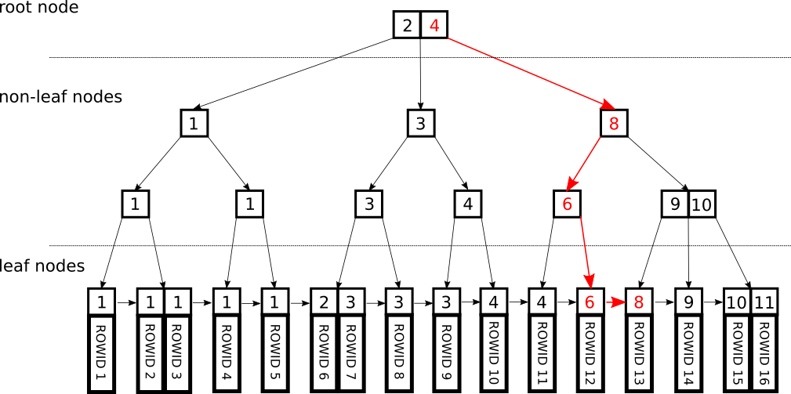

### Contents
- [개요](#개요)
- [B+Tree 인덱스란?](#B+Tree-인덱스란?)
- [다분기 트리와 이진 트리](#다분기-트리와-이진-트리)
- [B+Tree와 B-Tree](#B+Tree와-B-Tree)
- [References](#References)

## 개요

[웹 프로그래머를 위한 데이터베이스를 지탱하는 기술](http://www.yes24.com/Product/Goods/27893960) 도서를 읽고 B+Tree 인덱스 부분을 정리해보았다.

데이터베이스의 인덱스가 어떠한 자료구조로 구현되어 있고 어떻게 검색을 하는지 알아보자.

## B+Tree 인덱스란?

B+Tree 인덱스는 **Tree** 자료구조를 이용한 인덱스이다.
정상이 **루트(root) 블록**, **최하층이 리프(leaf)** 블록이라고 불리며, 그 사이에 **브랜치(branch) 블록**이 들어간다.
루트 블록과 브랜치 블록은 검색 키에 대해 해당 블록이 어디에 있는지에 대한 정보를 가지고 있다.

인덱스 검색 시에는 루트 → 브랜치 → 리프 순으로 도달하여 원하는 데이터를 얻을 수 있다.
레코드 수가 적으면 루트가 브랜치를 겸하며, 루트와 리프밖에 없는 패턴도 존재한다.

한편, 레코드 수가 매우 많은 경우 브랜치 아래에 브랜치가 들어가는 4계층 이상의 구성이 될 수도 있다.
레코드 수가 많아지면 많아질수록 브랜치 층도 늘어나고 계층도 늘어나게 될 것이다.

## 다분기 트리와 이진 트리

브랜치 및 리프의 분기 개수가 두 개밖에 없는 것을 특별히 **이진 트리**라고 한다.
B+Tree는 **다분기 트리**라고도 부르며, 분기 개수가 두 개 정도가 아닌 수십 개에서 수백 개에 걸치는 경우도 있다.
분기 개수를 많이 하는 이유는 계층의 단수를 줄여서 액세스 횟수를 적게 하기 위해서다.

이진 트리의 경우 N계층당 2^N개밖에 기록을 관리할 수 없다.
이진 트리의 경우 레코드 수 N당 탐색에 필요한 계산량이 O(log~2N)이 되는 것으로 알려져 있다.
O(N)과는 비교가 되지 않을 정도로 효율이 좋지만, 해시 인덱스 O(1)과 비교하면 효율성이 떨어진다.
B+Tree와 같은 다분기의 트리 구성을 취함으로써 O(log~mN)의 계산량이 되어 액세스 수를 크게 줄일 수 있다.

## B+Tree와 B-Tree

B-Tree라는 인덱스 구조도 있는데, 이는 모든 값을 리프 블록에서만 갖도록 제한하지 않으며 브랜치에서도 값을 가질 수 있는 데이터 구조다.
보통의 B-Tree 인덱스에 비하면 B+Tree 인덱스는 어떠한 검색이라 할지라도 루트에서 리프까지 거치지 않으면 열의 값을 검색할 수 없다는 단점이 있다.

그러나 브랜치가 보다 컴팩트하므로 인덱스 자체의 계층 구조를 작게 할 수 있다는 장점이 있다.
즉, 최악의 경우 액세스 횟수를 줄일 수 있다는 것을 의미한다.

또한 광범위하게 걸친 검색에서는 자기 자신의 리프 블록 뿐이라면 액세스가 완결되지 않는 경우가 있다.
B+Tree 인덱스에서는 그러한 경우에 주변의 리프 블록으로 거슬러 올라가 액세스해 나감으로써 원하는 결과를 반환할 수 있다.
B-Tree 인덱스의 경우 리프뿐만 아니라 브랜치에서도 키 정보를 가지고 있기 때문에 주변의 리프가 아닌 브랜치로 되돌아가 값의 존재 확인을 실시하고 그 위의 브랜치로 돌아가거나 아니면 다른 리프로 가는 등의 처리를 거쳐야만 한다.
그러나 B+Tree 인덱스라면 리프 블록에서 인접한 리프 블록으로 건너가는 것만으로 값의 탐색이 가능하기 때문에 보다 효율적이다.

B+Tree 인덱스를 사용하면 등호 검색은 물론 부등호나 전방 일치 검색 등의 범위 검색도 리프 블록을 스캔하는 것만으로 (브랜치를 그때마다 거쳐 나갈 필요 없이) 완결할 수 있다.
즉, 그만큼 고속이다. 이러한 높은 유연성이 B+Tree가 널리 이용되어 온 커다란 이유다.

## References

* [웹 프로그래머를 위한 데이터베이스를 지탱하는 기술](http://www.yes24.com/Product/Goods/27893960)
