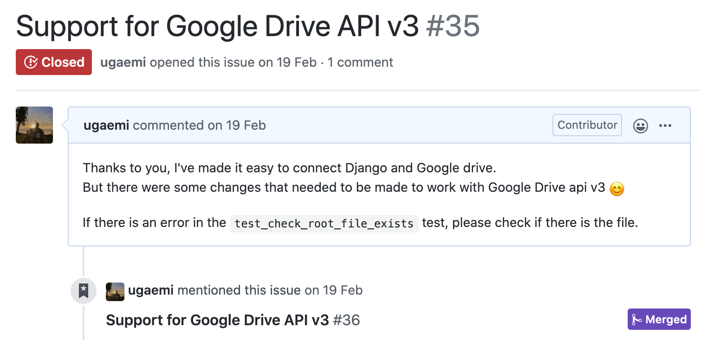
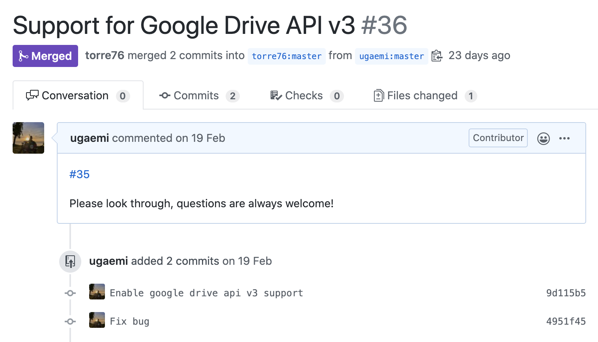
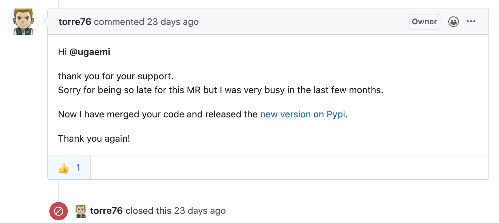
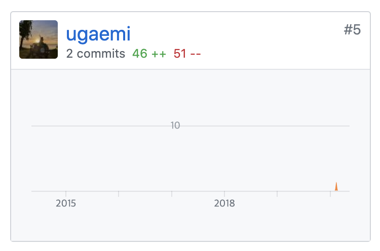

## 계기

> 나도 오픈 소스에 기여해보고 싶다!

라는 생각은 늘 있었지만 막상 어떻게 시작해야 할지 몰라서 미뤄두고 있었다.
당연한 말이지만 무작정 컨트리뷰팅을 해야겠다고 생각한 후에 오픈 소스에서 기여할 부분을 찾아내는 것은 힘들다.
현재 사용하고 있는 소스에 부족한 점을 커스터마이징 하다보면 자연스레 그러한 기회도 생기기 마련이다.
사실 이번에도 미처 "이 소스를 컨트리뷰팅해야겠다"라고 생각하지 못했는데, 사수님이 좋은 이슈이니 해보면 어떻겠느냐고 말해주셨을 때쯤에야 "아 이런 걸 기여하는 거구나" 했다.

## 과정

사내 프로젝트에서 Django Storage를 Google Drive와 연동하여 업로드 된 파일들을 드라이브에 저장시키는 이슈를 진행 중이었는데, 마침 [django-googledrive-storage](https://github.com/torre76/django-googledrive-storage)라는 오픈 소스를 찾아냈다.
하지만 Google Drive API v3이 아닌 v2 기반으로 짜여진 코드였고 원하는 기능을 위해서는 생각보다 손 봐야 할 부분이 많아졌다.
이 정도면 처음부터 만들어도 되지 않느냐고 생각할지 모르지만 그래도 이 오픈 소스가 뼈대의 역할을 톡톡히 해주었기 때문에 한결 수월하게 진행할 수 있었다.
다행히 테스트 코드도 만들어져 있는 상태여서 테스트를 통과할 수 있게끔 소스를 다시 정리한 후에 이슈를 열었다.

후에 PR을 열었다.
처음 해보는 컨트리뷰팅인지라 사수님의 도움을 많이 받았다 :D

사실 Google Drive API v3가 나온 지 꽤 되었는데도 업데이트를 안하신 걸 보고 컨트리뷰팅이 빨리 될 거라는 기대는 안했다.
역시 시간이 꽤 흐른 뒤에 답글을 받을 수 있었고 내 코드는 무사히 merge됐다 :)

짜잔! 레파지토리의 컨트리뷰터에 내가 등록됐다!

처음으로 오픈 소스에 기여를 해보고 느낀 점은

1. 생각보다 컨트리뷰팅 할 거리는 많다. 현재 사용하고 있는 오픈 소스들을 위주로 커스텀한 부분이 기여할 만한 이슈인지 생각해보자.
2. 내가 추가한 기능이 대단하지 않더라도 누군가에게는 필요했던 기능일 수 있다.
3. 이래서 하나 싶다. 정말 뿌듯하다.
4. PR 올린 후에는 목빠지게 기다리지 말자. 언젠간 답장이 온다.

한 번 하고 나니 어디 또 할 게 없나 찾아보게 된다.
좋은 오픈 소스를 찾아 쓰는 대가로 기여 해주는 일은 뿌듯한 일인 것 같다!