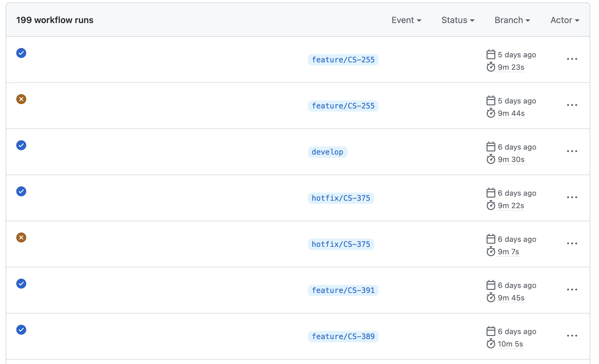
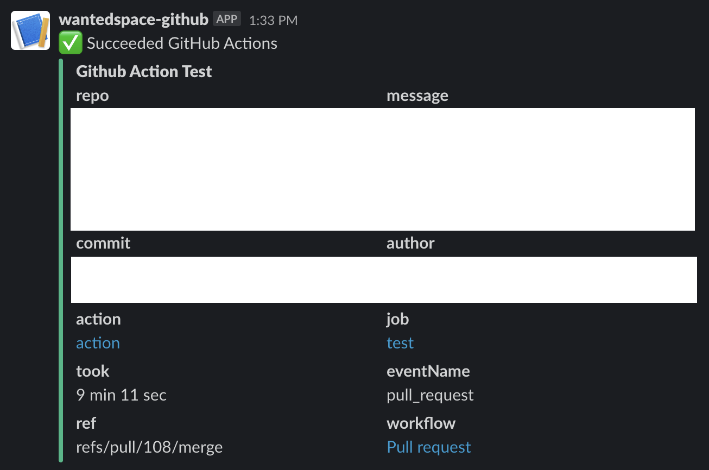
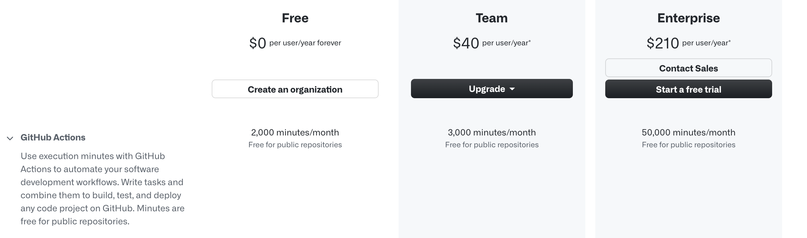

# 개요

현재 팀에 합류한 지는 4개월 정도 되었다. 나는 팀에서 뽑은 첫 백엔드 개발자였고, 기존에는 부문장님 한 분이서 백엔드 개발을 모두 담당하고 계셨다.
개발 팀원이 1명에서 2명이 되는 건 단순히 숫자가 늘어나는 것 뿐만 아니라 협업이 불필요했던 그동안의 개발 프로세스와 문화를 모두 통째로 들어내야하는 혁명이 필요한 일이라고 생각된다.

입사 초반에는 **신규 입사자를 위한 README 작성**부터 시작해 **로컬 환경 셋팅 방법**, **git 브랜치 전략 수립** 등 개발하기 좋은 환경 만들기!를 주도적으로 진행했다.
내가 고생을 하더라도 다음 사람은 고생을 덜 할 수 있도록 만들어두면 좋을 것 같단 생각을 했기 때문에 하나씩 차근차근 해나갈 수 있었다.

이후 이슈를 할당받고 API 개발을 진행하게 되었는데, 이미 많은 유저들이 사용중인 서비스를 개선해나가는 작업이 쉽지만은 않았다.
특히나 아직 익숙하지 않은 기존 코드들 사이에 내 피쳐를 집어넣으려니 사이드이펙트를 예상하기가 힘들었고, 권한 문제가 민감한 도메인이다보니 여러 계정으로 테스트를 해야 했는데 이를 반복하는 작업이 굉장히 번거로웠다.
홀로 개발>테스트>배포하는 사이클을 돌면서 예상치못한 장애를 마주치는 일도 빈번했다.
이렇게 개발하다간 끊임없는 장애와 CS에 시달리는 어두운 미래가 기다릴 뿐😭이라는 생각이 들었고, 테스트/배포 규칙 논의를 위한 자리를 만들어 팀원분들께 내 생각을 공유드리게 되었다.

그 중 가장 적극적으로 어필했던 부분은 테스트코드 작성과 테스트 자동화 프로세스 도입이었다.
테스트를 도와줄 인력이 부족하다면 코드라도 날 도와주도록 만들어야겠단 생각이 들었고, 테스트코드 작성을 해보자는 결론에 도달했다.
테스트코드가 쌓이면 그만큼 내가 반복적으로 해야 할 테스트가 줄어들 것이고 나보다 더 정확하게 오류를 짚어줄 수 있을 것이다.

CI 툴은 [TravisCI](https://travis-ci.org/), [CircleCI](https://circleci.com/) 등 여러가지가 있는데, 버전 관리를 Git/Github으로 하고 있으니 github의 [actions](https://github.com/features/actions) 를 활용해 되도록이면 사용 중인 플랫폼 내에서 환경을 구축하기로 했다.

## DRF API 테스트코드 작성

프로젝트는 Django 기반이며 API는 주로 Django Rest Framework로 작성되었다.
우리 프로젝트의 코드 곳곳에는 성능 향상을 위해 replica DB를 명시적으로 바라보도록 하는 부분이 있는데, 이를 테스트하려니 `replica` DB를 찾을 수 없다는 오류가 발생했다.
이를 해결하려면 테스트코드의 `databases`에 사용할 DB를 명시적으로 작성해주어야 한다.

```python
class ExampleAPITest(APITransactionTestCase):
    databases = ["default", "replica"] # 혹은 databases = "__all__"
```

또한 데이터베이스를 이용해 테스트할 목적이라면 `APISimpleTestCase`나 `APITestCase`는 취지에 맞지 않는다.
대신 `APITransactionTestCase`를 사용하자.
이는 트랜잭션에서 테스트를 래핑하고 각 테스트를 시작할 때 데이터베이스를 롤백할 수 있도록 한다.

## actions workflows 만들기

내가 구축하려 한 CI 프로세스는 간단하다.
누군가 PR(Pull Request)을 올리거나 오픈된 PR에 Push를 하면 actions workflows를 통해 스크립트를 돌고 테스트가 성공하면 슬랙으로 성공했다는 메시지를 보내고 머지 버튼을 활성화시키는 방식이다.

우선 프로젝트 root 하위에 `.github` 폴더를 만들고 그 하위에 `workflows` 폴더를 만든다.
CI 코드 외에도 actions를 활용한 자동화 스크립트가 추가될 수 있으니 `pull-request.yml` 혹은 `ci.yml` 와 같은 이름으로 파일을 하나 만든다.

**.github/workflows/pull-request.yml**

```yaml
name: Pull request

on:
  pull_request:
    branches:
      - "**"
```

actions의 이름을 정하고 어떤 액션이 어떤 브랜치에 발생했을 때 해당 스크립트를 돌릴 지에 대한 규칙을 적는다.
나는 모든 브랜치에 대해 PR이 발생하면 테스트를 돌릴 계획이었기 때문에 위와 같이 작성했다.

## yml 파일 작성

위 파일에 이어서 작성하면 된다.

```yaml
jobs:
  test:
    timeout-minutes: 20
    runs-on: ubuntu-latest
    env:
	  example: ${{ secrets.example }}
```

하나의 workflow에 대해 여러 job을 등록할 수 있다.
나는 `test`라는 이름의 job을 작성했고, `timeout-minutes`는 20분으로 작성했다.
해당 액션이 실행하는데 20분이 초과되면 자동 fail이 되는 조건이다.
`runs-on`에 해당하는 부분은 어떤 서버 버전 위에서 동작하도록 할지 지정하는 부분이다.
`env`는 job 내에서 사용될 환경변수를 저장하는 공간이다.
스크립트에 직접 작성하기에는 민감한 키 정보나 계정 정보는 Github repository의 **Settings > Secrets > Actions**에 등록해두고 `secrets`를 통해 변수로서 가져와 쓸 수 있도록 설정했다.

```yaml
steps:
  - name: Checkout
    uses: actions/checkout@v2
```

`steps` 하위에는 테스트를 위해 필요한 것들을 하나씩 작성해주면 된다.
`uses`에는 다양한 오픈소스를 작성하여 활용할 수 있는데, [checkout@v2](https://github.com/actions/checkout) 는 `${{ github.workspace }}` 하위에 체크아웃하는 action으로 스크립트에서 접근할 수 있도록 한다.

```yaml
- name: Build containers
  run: docker-compose -f docker-compose.test.yml build
```

프로젝트는 `docker-compose`로 컨테이너를 빌드하고 실행할 수 있도록 구성되어있다.
프로덕션/개발 환경과 다르게 test 환경에서는 AWS RDS를 사용하지 않고 직접 PostgreSQL 컨테이너를 따로 띄워 연결하여 사용하도록 구성했으므로 이에 따른 `docker-compose.test.yml` 파일을 만들었다.

```yaml
- name: Copy files
  run: echo "${{ secrets.file_name }}" > ${{ github.workspace }}/file_name.yml
```

기존 서버에서 `scp`를 통해 특정 파일을 가져와야 하는 이슈가 있어 actions의 오픈소스를 찾아서 적용해보던 와중에 vpn 등 추가로 설정해주어야 하는 것들이 많아져 해당 파일의 정보도 github secrets에 저장해두고 복사하여 쓰도록 했다.

```yaml
- name: Start containers
  run: docker-compose -f docker-compose.test.yml up -d

- name: Check docker status
  run: docker-compose -f docker-compose.test.yml logs --tail=100 && docker-compose ps

- name: Migration
  run: docker-compose -f docker-compose.test.yml exec -T web python manage.py migrate

- name: Run tests
  run: docker-compose -f docker-compose.test.yml exec -T web python manage.py test

- name: Stop containers
  if: always()
  run: docker-compose -f docker-compose.test.yml down
```

도커 컨테이너를 띄우고 DB를 마이그레이션하고 테스트를 돌리는 부분이다.
테스트가 끝나면 컨테이너를 종료시키도록 했다.

```yaml
- name: Send result to slack
  uses: 8398a7/action-slack@v3
  with:
    status: ${{ job.status }}
    author_name: Github Action Test
    fields: repo,message,commit,author,action,eventName,ref,workflow,job,took
  env:
    SLACK_WEBHOOK_URL: ${{ secrets.SLACK_WEBHOOK_URL }}
  if: always()
```

[action-slack@v3](https://github.com/marketplace/actions/action-slack) 를 통해 workflow가 끝나면 테스트 결과를 슬랙 채널로 받아볼 수 있도록 설정했다.
`fields`에는 받고 싶은 정보들(레파지토리명, 메시지, 커밋, 저자 등)을 입맛에 맞게 설정해주면 된다.



스크립트 작성을 완료하고, PR을 올려보면 actions에 아름다운 workflow 결과물이 쌓인다.



슬랙 채널로 테스트 결과 또한 정상적으로 오는 것을 확인할 수 있다.

## 참고



팀이 Github Free 플랜을 사용중이고 해당 프로젝트가 오픈소스 프로젝트가 아니라면 actions 소요시간이 월 2,000분으로 제한되어 있는 것을 참고하시면 좋을 것 같다. (우리 팀은 팀 플랜 업그레이드를 했다.)

## 결론

테스트코드 작성이 모든 버그를 피할 수 있도록 해주지는 않는다.
개발자가 테스트코드 자체를 잘못 작성했다던지, 필요한 테스트를 작성하지 못했다던지 하는 이유에서 발생하는 버그들도 생긴다.

고민을 해결하자 또 다른 고민들이 생겨났다.

1. 테스트코드를 어떻게 더 유의미있게 작성할 수 있을까? 불필요한 테스트코드는 무엇이고 필요한 테스트코드는 무엇일까?
2. 테스트코드가 늘어날 수록 workflow를 한 번 도는 데 걸리는 시간도 늘어나고 있다. 이를 더 단축시키는 방법이 있을까?
3. ...

이처럼 고민의 고민이 끝없이 생겨나고 있지만, 그래도 결론은 *도입하길 잘했다* 이다.
사전에 버그를 찾은 경험도 많아지고있고, 방대한 테스트를 push할 때마다 자동으로 돌려주니 이렇게 편할 수 없다.
팀원이 2명에서 3명이 되었을 때는 더 빛을 발할 수 있는 문화가 되지 않을까 싶다.

아직은 아주 간단한 프로세스이지만, 앞으로 자동화가 필요한 부분은 과감하게 처리하여 훨씬 더 생산성 있는 팀을 만들고 싶다.
