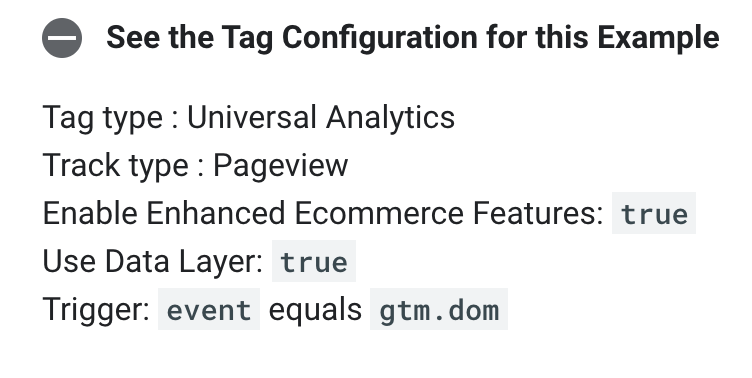
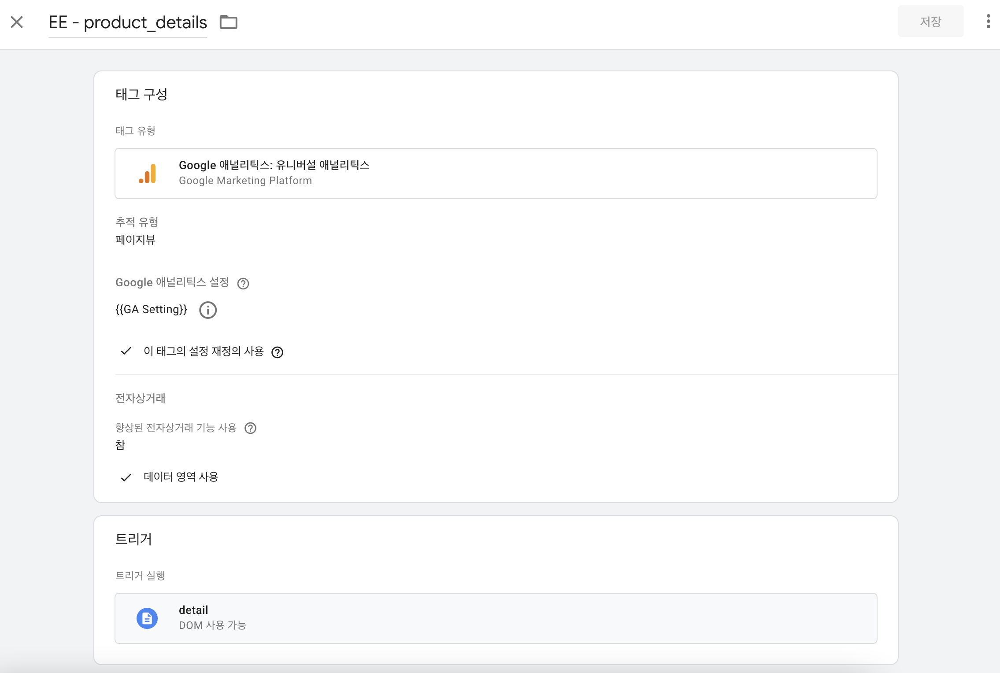
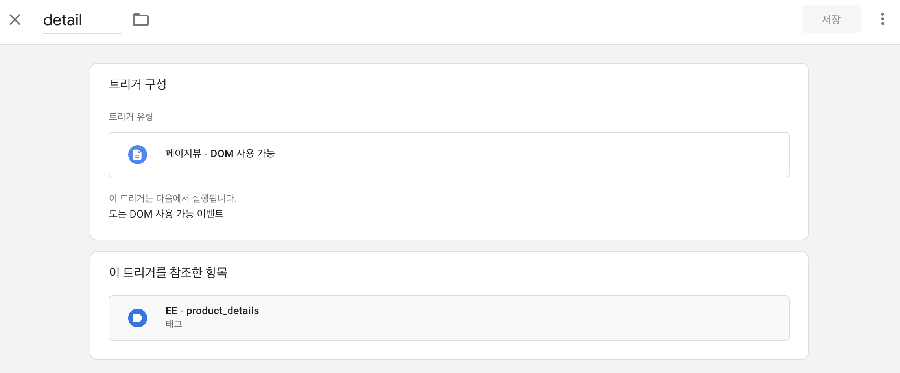
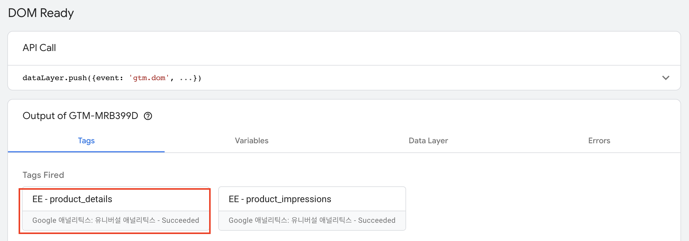
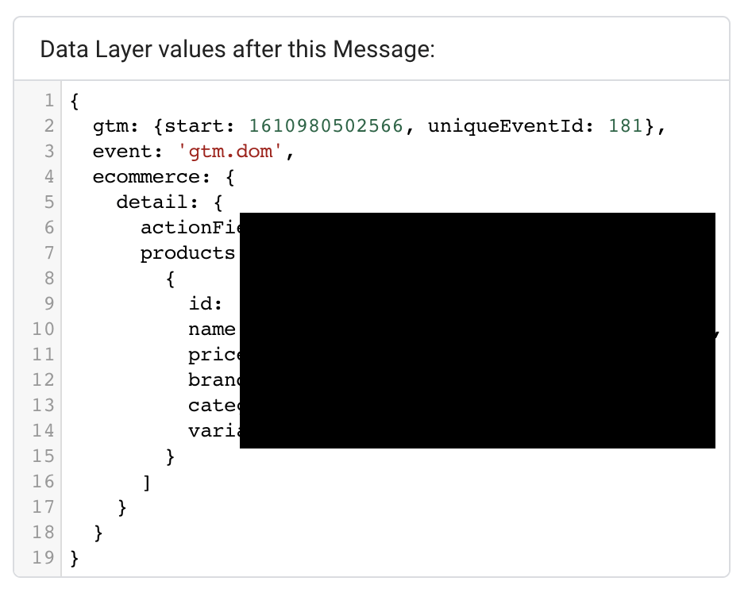
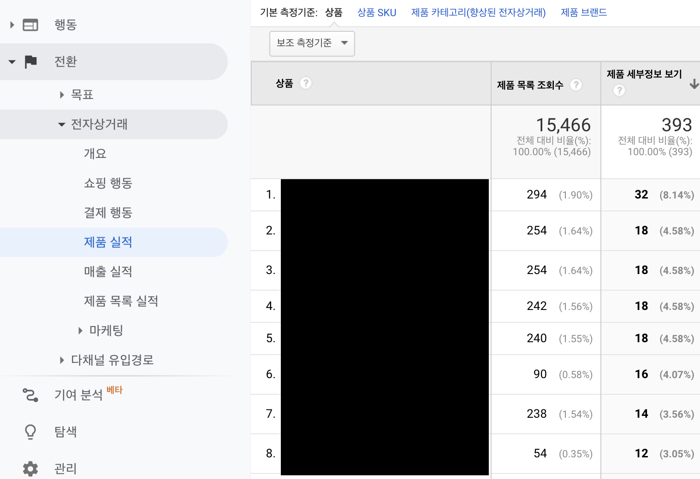

---
title: '🏷 고도몰 상품 상세 조회 추적하기'
subtitle: 'GTM Enhanced Ecommerce'
date: 2021-01-18
category: 'GTM'
draft: false
--- 

### Measuring Views of Product Details

> Ecommerce Measurement: `detail`
>
> Accepts Data: list, array of `productFieldObjects`

## 고도몰 상품 상세 페이지에 스크립트 추가하기

상품 상세(goods/goods_view.html) 디자인 페이지 마지막 부분에 `dataLayer`에 상품 정보를 push하는 스크립트를 추가하자.

다음 스크립트는 스킨에 따라 얼마든지 변경될 수 있는 부분으로, 상품 정보를 가져오는 코드는 직접 작성해야 한다.

추가 후 `dataLayer`에 데이터가 잘 쌓였는지 console로 확인해보자. (반드시 예시와 동일한 구조로 데이터가 들어가는지 확인하자.)

```html
<script>
dataLayer.push({
  'ecommerce': {
    'detail': {
      'actionField': {'list': 'Apparel Gallery'},
      'products': [{
        'name': 'Triblend Android T-Shirt',
        'id': '12345',
        'price': '15.25',
        'brand': 'Google',
        'category': 'Apparel',
        'variant': 'Gray'
       }]
     }
   }
});
</script>
```

## GTM 태그 & 트리거 설정하기

`dataLayer`에 데이터가 잘 들어오는 것을 확인했다면, [Google Tag Manager](https://tagmanager.google.com/)에서 태그를 만들자.





태그명은 알아보기 쉬운 이름으로 설정해준다.



트리거 유형은 DOM 사용 가능으로 설정해준다.

## Tag Fired 확인하기

이제 GTM 미리보기를 통해 상품 리스트 화면으로 들어간 후, 설정한 태그가 잘 작동되는지 확인해보자.



DOM Ready시에 방금 추가한 태그가 잘 작동되는 것을 확인할 수 있다.

`Data Layer` 탭에서 데이터 레이어를 확인해보자.



역시나 잘 쌓인 것을 확인할 수 있다.

## GA에서 확인하기



전환 > 전자상거래 > 제품 실적 탭으로 들어가보면, 수집된 제품 세부정보 보기 수가 보인다.

이렇게 향상된 전자상거래를 통해 제품 상세 조회 정보를 GA에서 확인할 수 있게 되었다!

## References

* [Enhanced Ecommerce (UA) - Product Detail](https://developers.google.com/tag-manager/enhanced-ecommerce#details)
