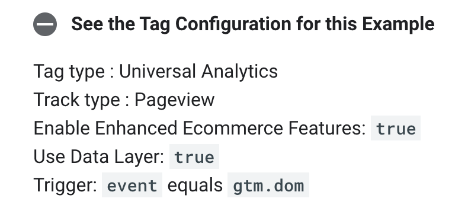
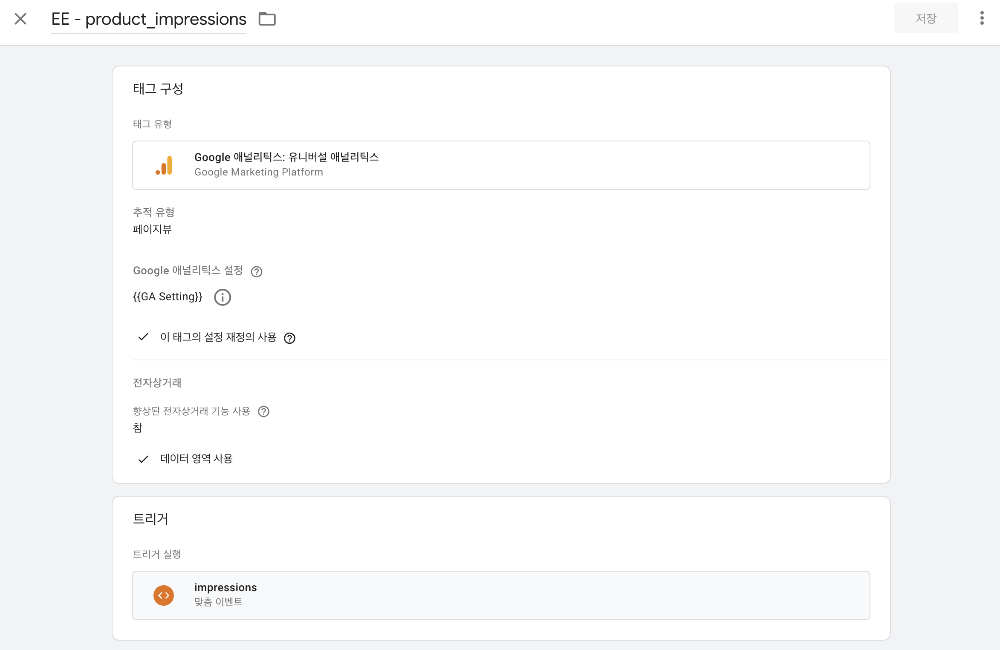
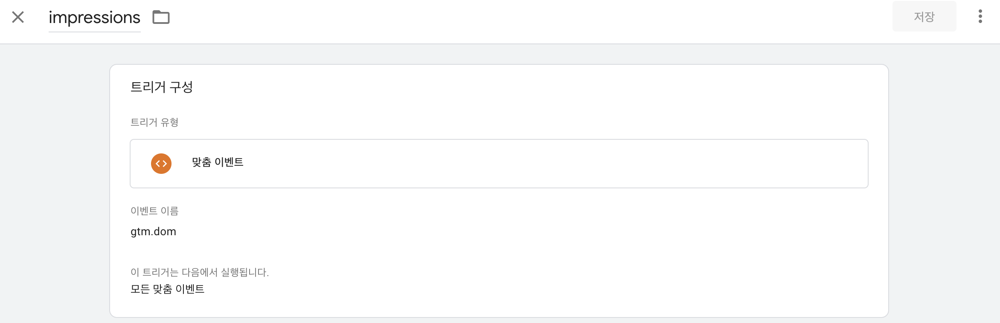
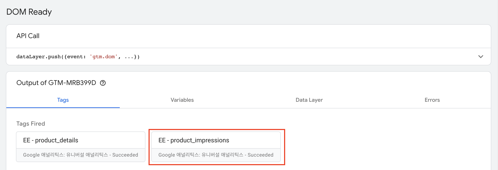
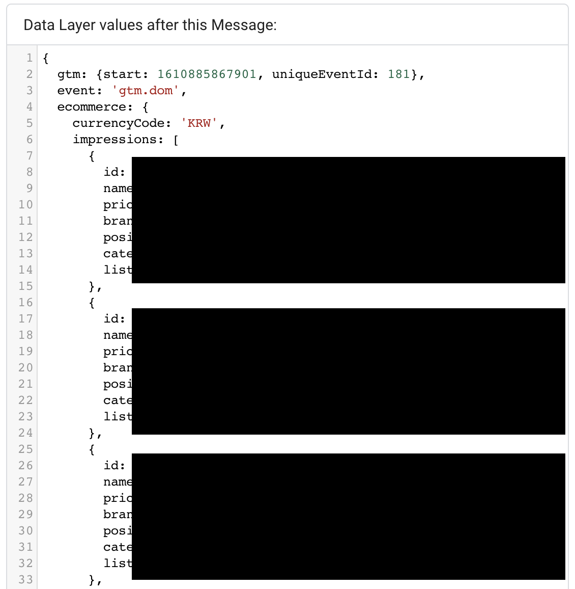
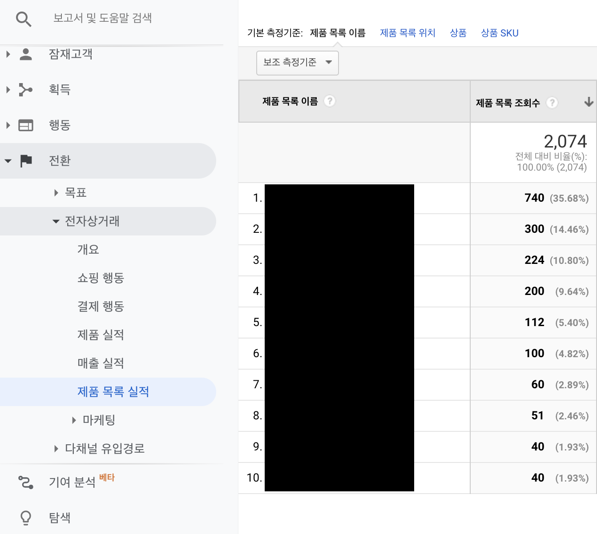

## 개요

고도몰 기반의 쇼핑몰에 GA의 향상된 전자상거래를 활용하여 쇼핑 행동을 추척하는 코드를 심는 작업이 필요했다.

나와 같이 헤매는 분이 없었으면 해서 고도몰 기반 EE 작업을 시리즈로 하나씩 정리해 볼까 한다. 

### Measuring Product Impressions

> Ecommerce Measurement: `impressions`
>
> Accepts Data: array of `impressionsFieldObjects`

아래 References에 올린 docs를 보며 따라하는 게 전부이지만 그 나름대로 이해하기가 힘들었다.
처음에는 docs에 보이는 스크립트를 GTM에 추가하여 `dataLayer`까지 잘 push했으나 GA에서 보이지 않아 삽질을 꽤 오래했다.

결국 고도몰 디자인 페이지에 직접 스크립트를 삽입하는 방식을 시도해보았고, 이 방법은 꽤 좋은 결과를 보여주었다. (자바스크립트 코드가 로드되는 타이밍의 문제가 아니었나 싶다.)

## 고도몰 상품 리스트 페이지에 스크립트 추가하기

상품 리스트(goods/goods_list.html) 디자인 페이지 마지막 부분에 `dataLayer`에 상품 정보를 push하는 스크립트를 추가하자.

다음 스크립트는 스킨에 따라 얼마든지 변경될 수 있는 부분으로, 상품 정보를 가져오는 코드는 직접 작성해야 한다.

추가 후 `dataLayer`에 데이터가 잘 쌓였는지 console로 확인해보자. 

```html
<script>
    dataLayer.push({
      'ecommerce': {
        'currencyCode': 'KRW',
        'impressions': [
         {
           'name': 'Triblend Android T-Shirt',
           'id': '12345',
           'price': '15.25',
           'brand': 'Google',
           'category': 'Apparel',
           'variant': 'Gray',
           'list': 'Search Results',
           'position': 1
         },
         {
           'name': 'Donut Friday Scented T-Shirt',
           'id': '67890',
           'price': '33.75',
           'brand': 'Google',
           'category': 'Apparel',
           'variant': 'Black',
           'list': 'Search Results',
           'position': 2
         }]
      }
    });
</script>
```

## GTM 태그 & 트리거 설정하기

`dataLayer`에 데이터가 잘 들어오는 것을 확인했다면, [Google Tag Manager](https://tagmanager.google.com/)에서 태그를 만들자.



docs의 **See the Tag Configuration for this Example** 토글을 열면 위와 같은 예시가 나오는데, 그대로 설정해주면 된다.



태그명은 알아보기 쉬운 이름으로 설정해준다.



트리거의 경우 이벤트명을 `gtm.dom`으로 설정해 주었다.

## Tag Fired 확인하기

이제 GTM 미리보기를 통해 상품 리스트 화면으로 들어간 후, 설정한 태그가 잘 작동되는지 확인해보자.



DOM Ready시에 방금 추가한 태그가 잘 작동되는 것을 확인할 수 있다.

`Data Layer` 탭에서 데이터 레이어를 확인해보자.



역시나 잘 쌓인 것을 확인할 수 있다.

## 한숨 자기

향상된 전자상거래 관련 데이터를 실시간으로 확인하는 방법을 찾지 못했다.

GA 보고서로 확인하기 위해서는 데이터가 수집되고 정리되기까지 시간이 걸리기 때문에, 조금 기다려보자.

## GA에서 확인하기



전환 > 전자상거래 > 제품 목록 실적 탭으로 들어가보면, 수집된 제품 목록의 조회수가 보인다.

이렇게 향상된 전자상거래를 통해 제품 목록 조회 정보를 GA에서 확인할 수 있게 되었다!

## References

* [Enhanced Ecommerce (UA) - Product Impressions](https://developers.google.com/tag-manager/enhanced-ecommerce#product-impressions)
