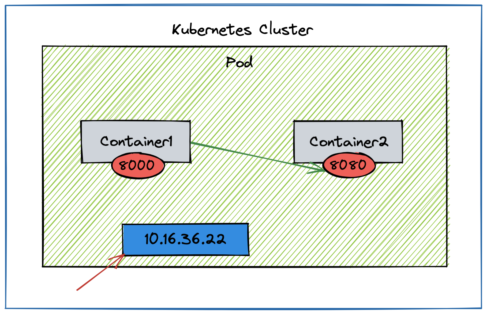
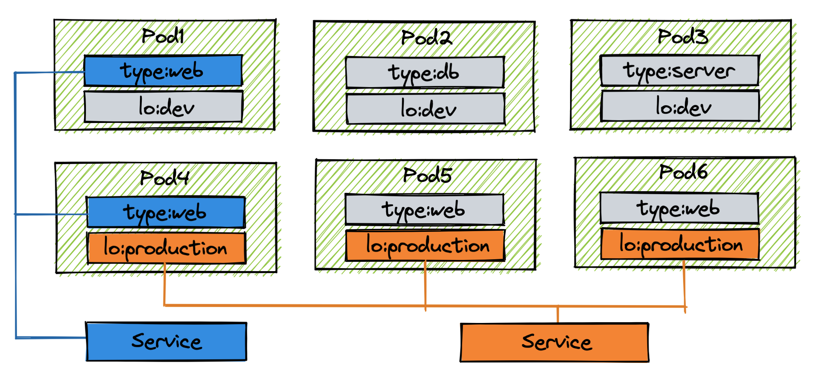
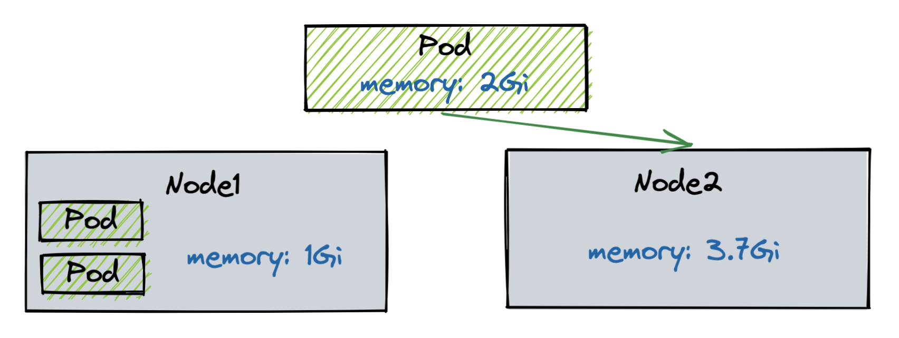

### Contents
- [개요](#개요)
- [Pod](#pod)
  - [Container](#container)
  - [Label](#label)
  - [Node Schedule](#node-schedule)
    - [직접 선택](#직접-선택)
    - [자동 선택](#자동-선택)
- [References](#references)

## 개요

꽤 오래 전, 인프런에 결제해 둔 쿠버네티스 강의가 있었다. (Reference 참고)
당시에는 실무에서 사용할 일이 없어서 이론 강의만 몇 개 듣고 묵혀두었는데 이직을 하고 맡게 된 프로젝트에는 쿠버네티스 기반 인프라 구성이 되어있어 저번 주말부터 다시 강의를 보기 시작했다.

오늘은 쿠버네티스의 주요 개념 중 하나인 Pod의 특징에 대해 정리해보려 한다.

## Pod

Pod는 쿠버네티스 애플리케이션의 최소 단위이다.
여러 개의 컨테이너로 구성된 Pod도 있고, 단일 컨테이너로만 이루어진 Pod도 있다.
Container를 Pod로 그룹화하는 이유는 **리소스를 더 지능적으로 공유하기 위해서**이다.
쿠버네티스 시스템에서는 같은 Pod에 속한 컨테이너끼리 동일한 컴퓨팅 리소스를 공유한다.

Pod의 특징에는 크게 Container, Label, Node Schedule이 있다.

### Container



- Pod 안에는 하나의 서비스를 구동할 수 있는 독립적인 컨테이너들이 있음
- 그 컨테이너들은 각각의 서비스를 연결할 수 있도록 포트를 가짐
  - 한 Pod 내에서 컨테이너들끼리 포트가 중복될 수는 없음
- Pod가 생성될 때 고유의 IP 주소가 할당이 됨
  - 쿠버네티스 클러스터 안에서만 해당 IP를 통해 Pod에 접근할 수 있음
  - 외부에서는 접근 불가
  - 재생성 시 IP는 변경이 됨 (휘발성)

```yaml
apiVersion: v1
kind: Pod
metadata:
	name: pod-1
spec:
	containers:
		- name: container1
			image: ugaemi/p8000
			ports:
				- containerPort: 8000
		- name: container2
			image: ugaemi/p8080
			ports:
				- containerPort: 8080
```

### Label



- Pod 뿐만 아니라 모든 Object에 달 수 있는데, 주로 Pod에서 가장 많이 사용됨
- 목적에 따라 Object들을 분류하고 분류된 Object들만 따로 골라서 연결하기 위함
- Key와 Value로 이루어짐
- 같은 라벨을 가진 Pod들끼리 서비스로 묶어 접속 가능

```yaml
apiVersion: v1
kind: Pod
metadata:
	name: pod-2
	labels:
		type: web
		lo: dev
spec:
	containers:
		- name: container
			image: ugaemi/init
```

```yaml
apiVersion: v1
kind: Service
metadata:
	name: svc-1
spec:
	selector:
		type: web
	ports:
		- port: 8080
```

### Node Schedule

- Pod는 결국 여러 노드들 중 하나의 노드에 올라가야 함
- 직접 노드를 선택하는 방법과 쿠버네티스가 자동으로 지정해주는 방법이 있음

#### 직접 선택


- Node에 Label을 달아 Pod를 만들 때 Node의 라벨을 지정

```yaml
apiVersion: v1
kind: Pod
metadata:
	name: pod-3
spec:
	nodeSelector:
		hostname: node1
	containers:
		- name: container
			image: ugaemi/init
```

#### 자동 선택



- 쿠버네티스의 스케줄러가 자동으로 어느 Node에 연결할지 판단
- Node에는 전체 사용 가능한 자원량이 있음 ex) 메모리, CPU 등
- Pod에 필요한 자원량을 지정해두지 않으면 연결된 Node의 자원을 무한정 사용하게 됨
  - 나머지 Pod들이 사용할 자원이 부족해져 다같이 죽을 수 있음
  - memory: 초과 시 Pod 종료 시킴
  - cpu: 초과 시 request로 낮춤, over 시 종료되지 않음

```yaml
apiVersion: v1
kind: Pod
metadata:
	name: pod-4
spec:
	containers:
		- name: container
			image: ugaemi/init
			resources:
				requests:
					memory: 2Gi
				limits:
					memory: 3Gi
```

## References

- [쿠버네티스 포드란?](https://www.redhat.com/ko/topics/containers/what-is-kubernetes-pod)
- [대세는 쿠버네티스](https://www.inflearn.com/course/%EC%BF%A0%EB%B2%84%EB%84%A4%ED%8B%B0%EC%8A%A4-%EA%B8%B0%EC%B4%88/dashboard)
