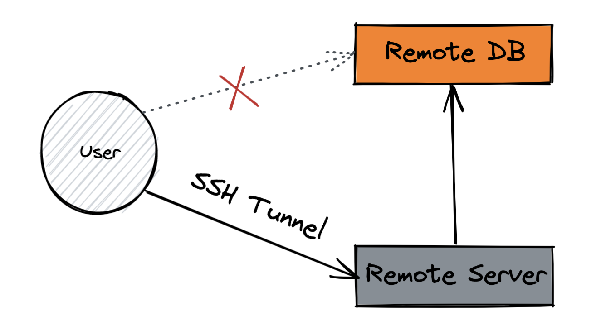
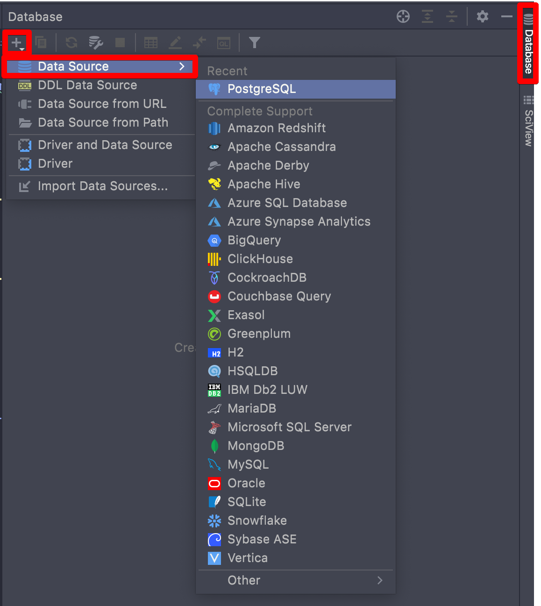
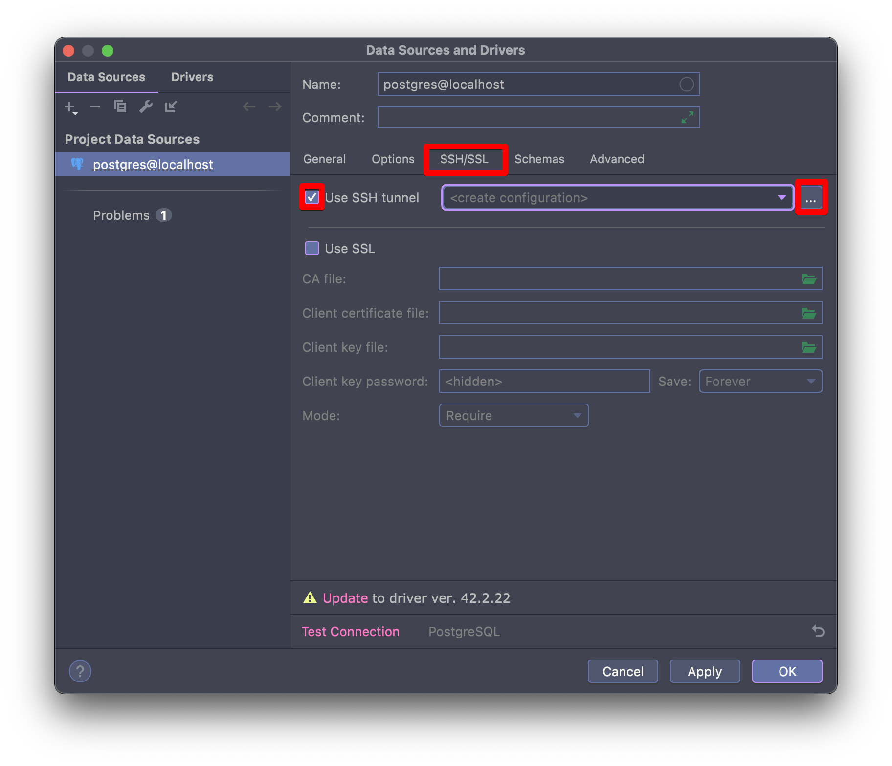
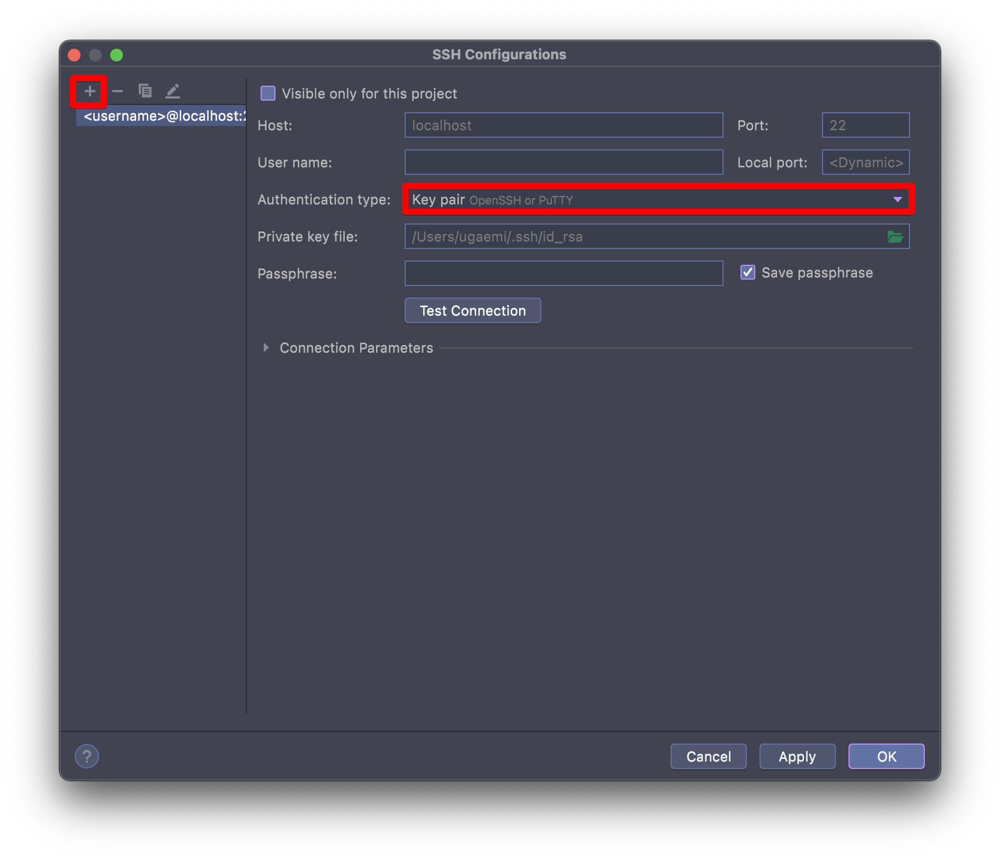

### Contents
- [개요](#개요)
- [SSH(Secure Shell)란?](#sshsecure-shell란)
- [SSH Tunneling이란?](#ssh-tunneling이란)
    - [SSH Tunneling 쉘 명령어](#SSH-Tunneling-쉘-명령어)
    - [Pycharm Database SSH Tunneling 설정 방법](#pycharm-database-ssh-tunneling-설정-방법)
- [References](#references)

## 개요

VPN을 통해서만 접속이 가능한 데이터베이스 서버를 로컬에서 접근하기 위해 ssh tunneling을 이용한 port forwarding 방법을 찾아보게 되었다.
SSH의 정의부터 Tunneling 방법, 추가로 Pycharm tunneling 설정 방법도 덧붙여 설명해본다.

## SSH(Secure Shell)란?

네트워크 상의 다른 컴퓨터에 접속하여 명령어를 실행할 수 있는 응용 프로그램 혹은 프로토콜을 의미한다.
기존의 rsh, rlogin, telnet 등을 대체하기 위해 설계되었으며, 강력한 인증 방법 및 안전하지 못한 네트워크에서 안전하게 통신을 할 수 있는 기능을 제공한다.
기본적으로는 22번 포트를 사용한다.

우리는 다음 명령어를 통해 원격 서버에 쉽게 접속할 수 있다.

```bash
ssh -i "{identityFile}" username@host
```

필자는 참고로 여러 개의 서버 접속 정보를 보다 쉽게 관리하기 위해 [Termius](https://termius.com/) 라는 프로그램을 이용하고 있다. (부분 유료)
Windows의 [Putty](https://www.putty.org/) 와 유사한 응용 프로그램으로, SSH 접속 정보를 GUI를 통해 편리하게 관리할 수 있다.

## SSH Tunneling이란?



SSH 클라이언트와 SSH 서버 사이의 연결 통로 자체를 SSH Tunnel이라고 부른다.
SSH Tunneling은 프록시와 비슷하게 동작한다.
위 그림처럼 로컬(SSH 클라이언트)에서 Remote Server를 통해 Remote DB로 접속할 수 있다.

### SSH Tunneling 쉘 명령어

SSH Tunneling에 대해 개념을 잘 알고 있다면 설정 방법은 쉽게 따라할 수 있다.
다음은 원격 서버를 통해 원격 DB 서버에 접근할 수 있도록 명령어이다.

```bash
ssh -i {identityFile} -L {localPort}:{remoteDBHost}:{remoteDBPort} {remoteUsername}@{remoteHost}
```

`identityFile`에는 원격 서버를 접속하기 위해 필요한 .pem 파일 등의 위치를 설정해주면 된다.
`localPort`는 로컬에서 현재 사용하지 않는, ssh 터널을 열어도 상관없는 포트를 하나 임의로 지정하여 넣어주면 된다.
설정 후 `lsof -i {port}`를 통해 터널링 설정이 잘 되었는지 확인할 수 있다.
`-L` 옵션은 지정된 원격 호스트와 포트에 전송할 로컬 포트 설정을 위한 옵션이다.

중개 서버와 원격 서버 호스트 정보를 알맞게 지정하고 명령어를 실행하면 잘 동작하는 것을 확인할 수 있을 것이다.
해당 프로세스를 종료하면 당연히 ssh 터널링도 제한되므로 주의하도록 하자.

### Pycharm Database SSH Tunneling 설정 방법

Pycharm에는 SSH Tunneling을 통해 데이터베이스를 연결할 수 있도록 하는 GUI가 제공된다.

우측의 Database 탭을 클릭하면 상단에 **+** 버튼이 나온다.
버튼을 클릭하여 **Data Source**에서 Import 해야하는 DB의 종류를 클릭해보자.



DB 종류를 선택했다면, **SSH/SSL** 탭을 클릭하여 **Use SSH tunnel** 체크박스를 체크한다.
select box가 활성화되면 우측의 **더보기** 버튼을 클릭한다.



마찬가지로 좌측 상단의 **+** 버튼을 눌러 SSH 설정을 추가해보자.
인증 유형에 따라 Password, Key pair, OpenSSH configure 등으로 설정할 수 있다.
Host, Port, Username, Authentication type 등의 설정을 완료했다면 **Test Connection**을 통해 접속이 잘 되는지 테스트해보자.



## References

- [위키백과](https://en.wikipedia.org/wiki/Secure_Shell)
- [SSH Tunneling 개요](https://storycode.tistory.com/293)
