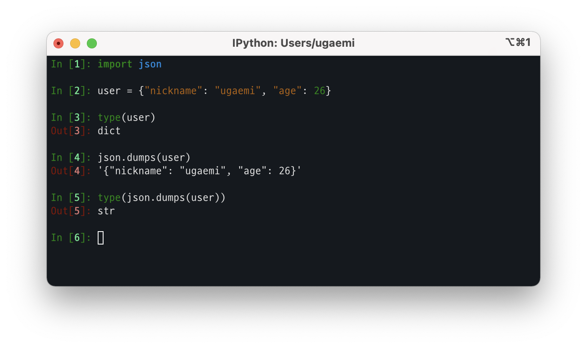
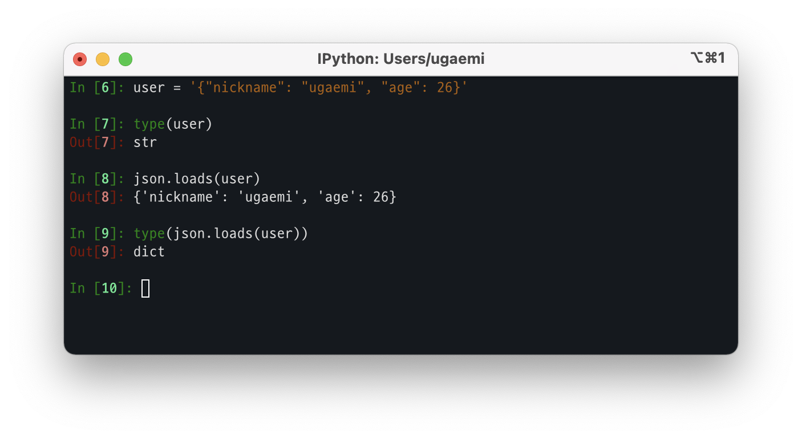
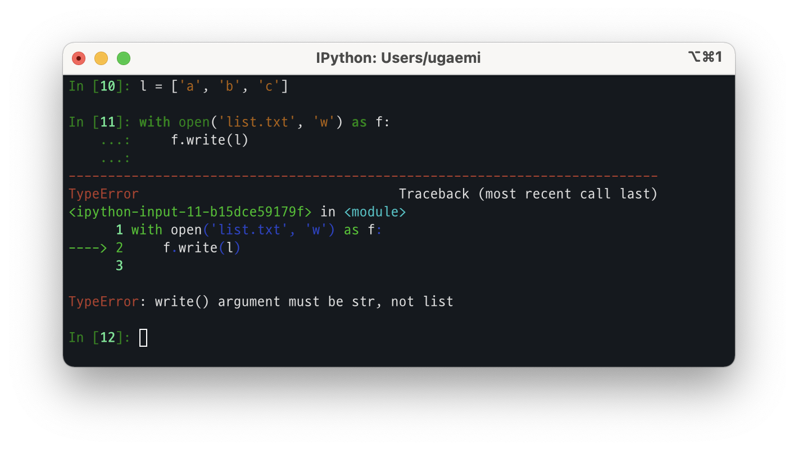
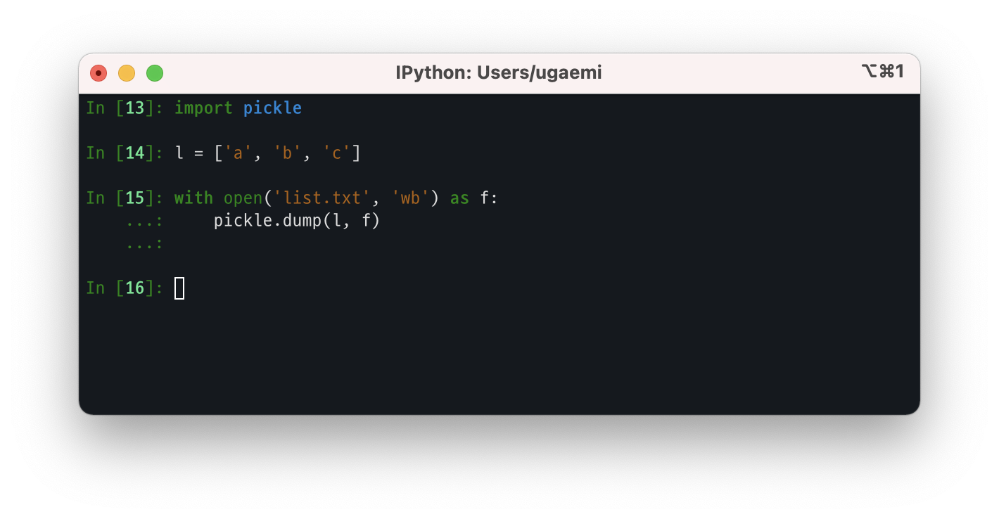

## json

파이썬 객체를 JSON 형식으로 직렬화(인코딩) 또는 역직렬화(디코딩) 하는 모듈이다.

## pickle

파이썬 객체 구조를 직렬화 또는 역직렬화 하는 바이너리 프로토콜이다.
pickling은 파이썬 객체 계층 구조가 바이트 스트림으로 변환되는 절차이며, unpickling은 그 반대 연산이다.

> `pickle` 모듈은 안전하지 않다. 신뢰할 수 있는 데이터만 unpickle 해야 한다.
신뢰할 수 없는 데이터를 처리하는 경우에는 `json` 모듈이 더 안전하다.

일반 텍스트를 파일로 저장할 때는 파일 입출력을 사용하지만 pickle 모듈을 이용하면 원하는 데이터를 자료형의 변경없이 파일로 저장하여 그대로 로드할 수 있으므로 주로 텍스트 이외의 자료형을 파일로 저장할 때 쓰인다.

## marshal

Go에서의 `Marshal`은 데이터를 JSON 포맷으로 변환하는 인코딩 함수로, 파이썬의 `json`과 비슷하다.
같은 이름의 내부 모듈이 파이썬에도 존재하는 것을 오늘에야 알았다.
이름은 같지만 동작하는 방식은 전혀 다르다.

파이썬의 `marshal`은 `pickle`보다 좀 더 원시적인 직렬화 모듈로,주로 파이썬의 `.pyc` 파일을 지원하기 위해 존재한다.

## pickle vs marshal

`pickle`과 `marshal`은 아주 비슷해 보이지만 차이점이 분명히 있다.

- `pickle` 모듈은 이미 직렬화된 객체를 추적하기 때문에 나중에 동일한 객체에 대한 참조가 다시 직렬화되지 않는다. `marshal`은 그렇지 않기 때문에 재귀적 객체를 marshaling하려고 시도하면 파이썬 인터프리터가 충돌한다.
- `marshal`은 사용자 정의 클래스와 해당 인스턴스를 직렬화할 수 없다.
- `marshal`은 파이썬 버전에서 호환성 보장이 안된다.

## pickle vs json

`pickle`과 `json` 사이에는 근본적인 차이점이 있다.

- `json`은 텍스트 직렬화 형식인 반면, `pickle`은 이진 직렬화 형식이다.
- `json`은 사람이 읽을 수 있지만 `pickle`은 읽을 수 없다.
- `json`은 상호 운용 가능하며 파이썬 생태계 외부에서도 널리 사용되는 반면, `pickle`은 오직 파이썬 전용이다.

## References

- [Python Documentation](https://docs.python.org/3/library/json.html#basic-usage)
