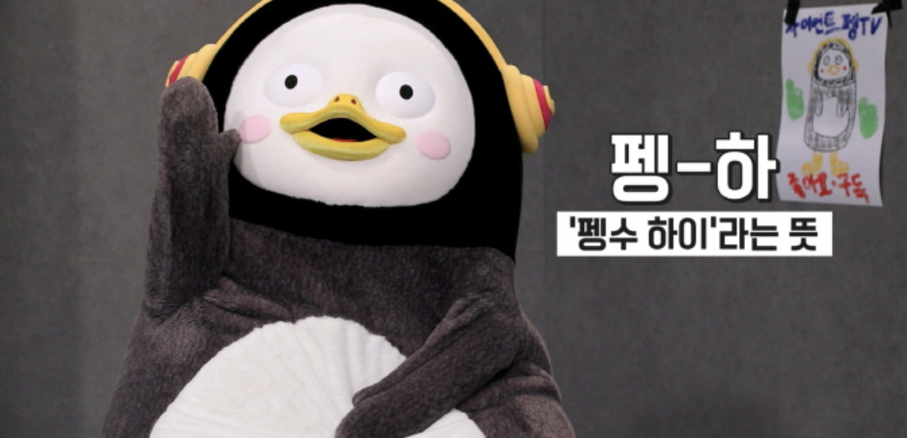
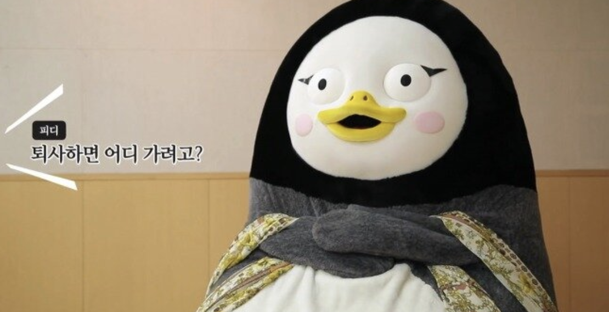
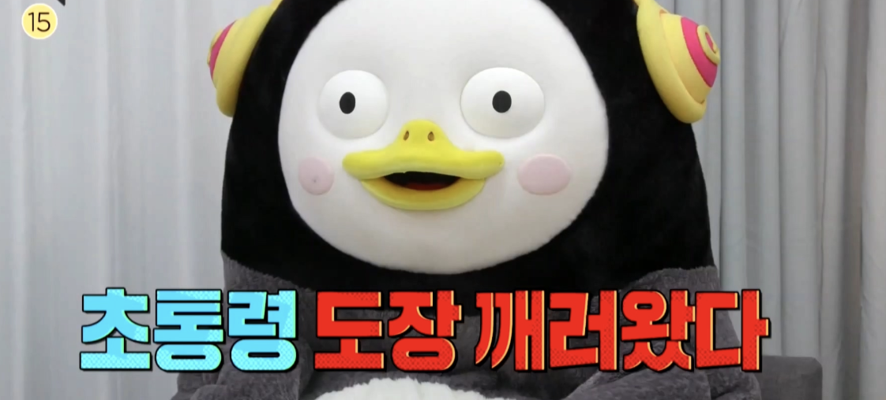
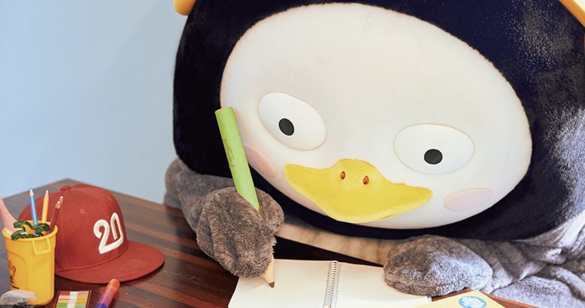
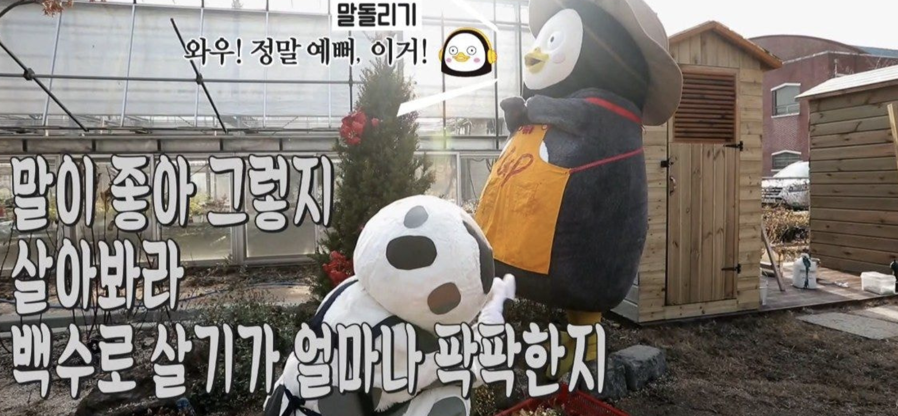
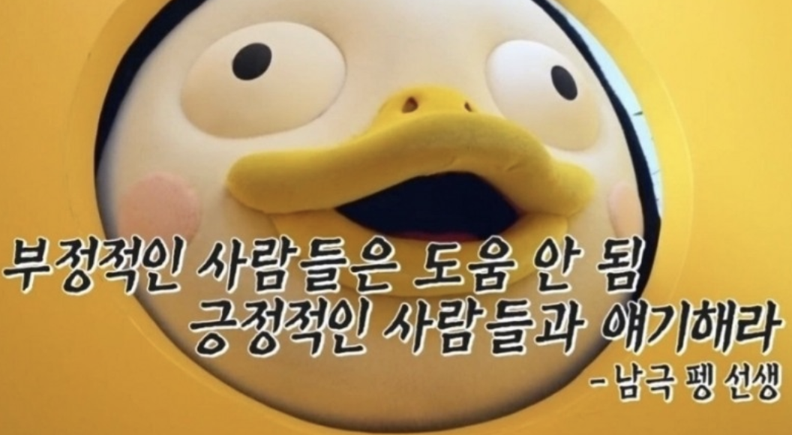
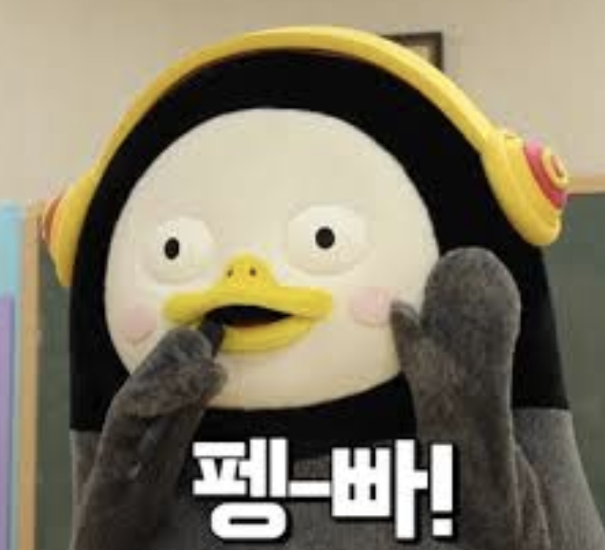

모두들 펭-하! (늦은 덕질이 위험하다.)

2019년이 흘러가고 있다.
새해가 오기 전, 올 한 해를 돌아보려 한다.

## 퇴사와 입사 그리고... 퇴사

1년 안에 두 번의 퇴사를 한 사람은 흔치 않을 것이다.
나도 딱히 겪고 싶지 않은 경험을 하게 되어서 유감이었다 ㅋ..

[첫 회사를 5개월만에 그만두었다](http://ugaemi.com/retrospect/I-quit-my-job/) 글을 보신 분이라면 이해가 되실 거다.. 따흑
이때문에 이력서가 조금..(아니 많이) 맘에 안든다; ㅎㅎ
그래도 올해가 가기 전에 모든 일이 해결되어서 다행이라고 생각한다!

## 개발 컨퍼런스 도장 깨기

올 해는 가고 싶었던 컨퍼런스들을 모두 참석했다.

1. 99CON
2. AWS Summit
3. Pycon
4. DEVIEW

[99CON](https://booking.naver.com/booking/12/bizes/116060)의 경우에는 기술적인 이야기가 아닌 수습 생활이라는 주제의 썰(?) 위주 발표였다.
비교적 다른 컨퍼런스들에 비해 가벼운 주제라 그런지 다양하고 재미있는 발표들이 많았다.

[AWS Summit](https://aws.amazon.com/ko/events/summits/seoul/)처럼 대규모의 컨퍼런스를 가 본 적은 처음이었다.
발표 내용에 대해서 절반은 이해하지 못했지만(?) 좋은 경험이었다.

[Pycon](https://www.pycon.kr)은 이 중에서 가장 기대했던 컨퍼런스였다.
파린이로써 흥미로웠던 주제들도 많았고 발표를 통해 다른 회사들은 파이썬을 어떻게 이용하는지 들을 수 있어 좋았다.

[DEVIEW](https://deview.kr/2019)는 가장 만족도가 높았던 컨퍼런스였다.
어려운 주제들도 잘 이해할 수 있게 해주신 발표자 분들이 참 대단해 보였다!

## 시험을 치르게 하는 시험의 연속

일학습병행제 인턴십 프로그램을 마무리하고 봄에 외부 평가를 치렀다.
또 퇴사 후에는 미뤄뒀던 정보 처리 기사 실기 시험을 봤다. (솔직히 통과할 줄은 몰랐는데.. 허허)
두 시험 모두 난이도가 어려운 편은 아니었지만 그저 **시험**이라는 타이틀 때문에 저어엉~말 공부하기 싫었다.
그래도 따고 나니 수료증(?)과 같은 느낌으로 노력에 대한 결과물을 받은 것 같아 뿌듯했다.

## 반 백수의 고통

말이 백수지 외주를 2건이나 해내느라 혼났다.
프리랜서와 백수 그 어디 쯤에서.. 3개월을 보냈다.
회사 다닐 땐 프리랜서가 되고 싶었는데 막상 겪어 보니 회사원이 10배 정도 낫다.
그나마 맡은 일이 쉽고 간단한 사이트라 망정이지, 일마저 힘겨 웠다면 훨씬 버티기 힘들었을 거다.
하루빨리 내 보금자리를 찾으러 떠나야겠다 ^ㅁ^;

## 자기계발의 시간

백수가 되니 오롯이 **나 혼자**서 보낼 수 있는 시간이 많아 여러가지 일을 했다.

그 중 한 가지는 **독서**다. 올 해는 꽤 많은 책을 읽었다.
[부의 추월 차선](http://www.yes24.com/Product/Goods/9440838), [소프트 스킬](http://www.yes24.com/Product/goods/23161141), [클린 코드를 위한 테스트 주도 개발](http://www.yes24.com/Product/Goods/16886031) 등...
이 중 추천하고 싶은 책을 꼽자면 (개발 관련 책은 아니지만) 정말 재미있게 읽었던 책은 [철학은 어떻게 삶의 무기가 되는가](http://www.yes24.com/Product/Goods/68749139)이다.
딱딱하고 어려운 철학을 쉽고 재미있게 풀어낸 책인데 정말 재밌다. 꼭 한번 읽어보시길 추천한다.

두 번째는 **운동**이다.
올 여름에는 요가를 해보려고 학원을 끊었는데.. 요가는 나랑 잘 안맞는 운동인 것 같다 ㅋㅋㅋ
선생님들 시간에 맞춰서 가야하는 요가 프로그램보다 애플워치와 함께하는 나이키 트레이닝을 더 열심히 했다.
앞으로도 그럴 것 같아서 요가 학원은 연장하지 않으려고 한다ㅎ 쿨럭

세 번째는 **개발**이다.
개발 관련 도서도 많이 읽고 토이 프로젝트(본도, 이말이야 등)도 시작하면서 취준 기간에 나태해지지 않으려고 노력했다.
[개미의 개발 노트](http://ugaemi.com)에는 올 한 해 총 33편의 포스팅을 했다.
내년 목표는 양질의 포스팅을 통해 [Google Adsense](https://www.google.com/intl/ko_kr/adsense/start/#/?modal_active=none) 심사를 통과하는 것이다! 빠-밤

마지막으로는 **네트워킹**이다.
DevTycoon 이후로 컴주개 밋업을 통해 주기적으로 학교 선후배들과의 만남을 가지고 있다.
또 동기들과 RCOD라는 스터디 그룹을 만들어 2주마다 발표를 하는 형식으로 개발 스터디를 진행 중이다.
열심히 사는 주변인들만큼 자극이 되는 것도 없더라.

## 펭-빠 2019 펭-하 2020

2020년은 쥐띠의 해!

쥐띠인 나에게 행운을 가져다 줄 해가 아닐까 싶다.
올 한 해 힘겨운 일도 많았지만 잘 이겨낸 것처럼 내년도 그러지 않을까? 헤헷
귀여운 펭수와 함께 건강하고 사랑하는 한 해가 되길 빈다.

그럼 펭-빠!