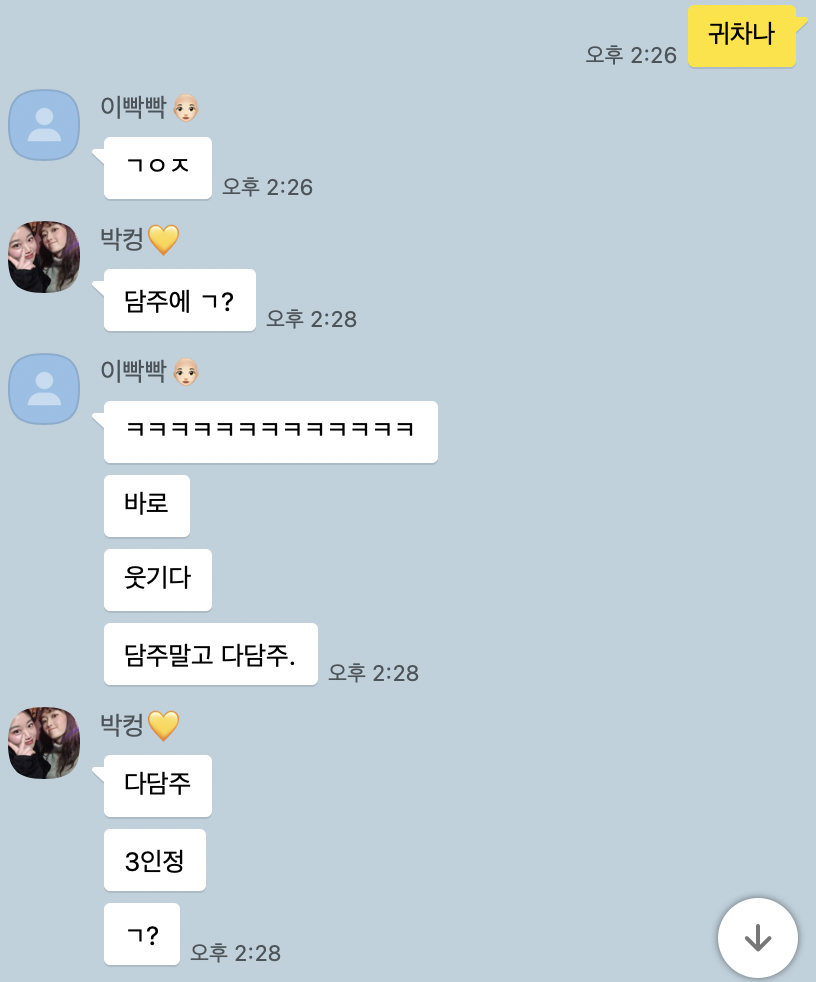
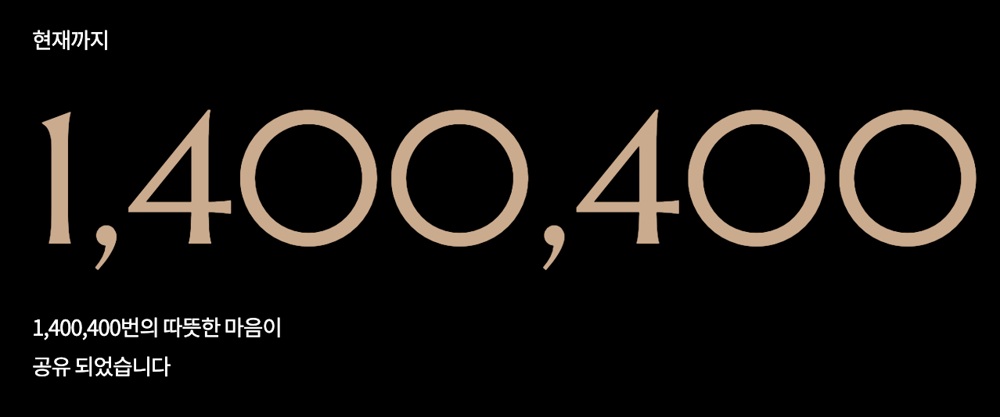

연휴가 끝나간다.

내일은 2021년 첫 출근이다.
마음가짐도 새롭게 할 겸 2020년 회고를 작성해 본다.

## 세번째 회사

나를 잘 모르는 분들이라면 사회 초년생이 이직을 왜 이렇게 자주한거야? 라고 할 수 있지만 그간의 사정을 아는 주변 사람들은 진심으로 축하해 준 나름 성공적인 이직이었다.

2020년 1월, 최종 합격 소식을 듣고 정말 맘 편히 사이판 여행을 다녀왔던 것 같다.

어느 회사든 장단점이 분명히 있지만, 그럼에도 확실히 말할 수 있는 것은 지금의 회사는 전 직장에서 했던 모든 걱정들을 하지 않게 해주었다. (이것만으로도 꽤 만족스러운 직장 생활을 하고 있다고 생각한다.)
이직을 하고 업무에만 집중할 수 있는 환경이 만들어지니 일에 욕심도 생기고 프로젝트를 잘 해내고 싶은 마음도 커졌다.

프로젝트 또한 정말 재미있게 해나가고 있다.
이전까지는 다른 사람이 사용하는 모습을 보기가 힘든 프로젝트 뿐이어서 사용자들의 피드백에 목말라 있었는데 지금은 실 사용자들에게 정말 다양한 피드백을 받아볼 수 있는 점에서 서비스 개발이 정말 재밌다고 느꼈다.

[그룹웨어 프로젝트](https://brunch.co.kr/@plusx/61?fbclid=IwAR3l1bh8tyb94TQoY56e9e8dgMiCuYF1zftKpcftHnD-Mi5CFJnHOmjl_Vo)

업무 외적으로도 새롭게 경험하게 된 부분이 많다.
특히 최근 사수님이 퇴사를 하시게 되면서.. 감히(?) 내가 책임져야 할 부분이 많아졌다.
신입 개발자 채용부터 시작해서 긴급 이슈 대응 및 컨텍 포인트 담당까지..
요즘 정말 출근하면 퇴근까지 눈코뜰새 없이 바쁘지만 이 또한 빠른 성장의 밑거름이 되어주지 않을까 싶다.

사실 초반에는 주니어가 이런 일까지 하는게 맞나? 라는 생각도 들었지만, 시간이 지날수록 그 '주니어 개발자'라는 말이 나를 더 우물 안으로 집어넣는 단어가 되는 것 같았다.
물론 나는 주니어가 맞고, 아직도 갈길이 멀다.
하지만 마음가짐까지 그렇게 가지면 계속해서 그 자리에 남아있을 수 밖에 없는 것 같다는 뜻이다.

벌써 입사 1주년이 코앞이다.
작년을 돌아보니 여러모로 이 회사에 참 잘 왔다는 생각이 들었다.
올해는 더 열심히 해야겠지..! 껄껄

## 오픈소스 컨트리뷰팅

처음으로 오픈소스에 기여해 보기도 했다.

[나의 첫 오픈소스 컨트리뷰팅](https://ugaemi.com/contributing/My-First-Contributing/)

이후에는 오픈소스 컨트리뷰톤에 참가하여 RustPython에 기여하기도 했다.

[Implement __ne__ methos for array, bytearray](https://github.com/RustPython/RustPython/pull/2028)

컨트리뷰톤 당시에 크게 기여하지 못했지만, 멘토님과 팀원분들이 열심히 해주셔서 운좋게 입상도 하게 됐다.
무엇보다 오픈소스 생태계를 좀 더 이해할 수 있었고, 이렇게 큰 프로젝트에 PR을 올려본 것 자체가 신기했다.

올해는 작년보다 더 많은 기여를 할 수 있도록 노력해야겠다.

## 꾸준히 RCOD

19년도에 만들었던 동기들과의 개발 스터디 RCOD가 벌써 3년차로 접어들었다. wow
20년도에는 [HTTP 완벽 가이드](http://www.yes24.com/Product/Goods/15381085) 책을 읽고 서로 설명해주는 스터디를 진행했고 (완독성공!), 요즘은 [33-js-concepts](https://github.com/leonardomso/33-js-concepts) 를 같은 방식으로 진행하고 있다.
(물론, 아주 가끔 스킵할 때도 있다ㅎ)

## 꽃 MBTI

2020년 가장 강렬히 기억에 남을 프로젝트는 뭐니뭐니해도 [꽃 MBTI](https://lu42.co.kr/campaign/flowergarden/mbti.php?utm_source=pr&utm_medium=display_image&utm_campaign=flowergarden&utm_content=banner_fossula)가 아닐까 싶다.
테스트 결과 공유 시 의료진 분들에게 자동으로 1000원이 후원되는 좋은 취지로 시작해 흔한 MBTI 테스트보다 훨씬 높은 정확도로 입소문을 타기 시작해 결국 3일동안 네이버 검색 순위에 올라있던..! 그 꽃 MBTI를 함께 만들고 대응한 것이 아직도 놀랍다.
예상보다 몇십, 아니 몇백배는 많았던 트래픽 덕분에 단기간에 정말 많은 경험을 하게 되었다.
이 프로젝트의 비하인드는 담을 내용이 많아 따로 포스팅을 하는 편이 좋을 것 같다.

## 코로나 때문에

아마 2020년에 가장 많이 언급된 말이 아닐까?

> 코로나 때문에 못 만날 것 같아
>
> 코로나 때문에 취소했어
>
> 코로나 때문에 집에 있어
>
> 코로나 때문에 ...

코로나 때문에 재택 근무라는 것도 해보고

코로나 때문에 화상 면접도 해보고

코로나 때문에 올해 기억에 남은 추억이 몇 없다.

그러나 코로나 때문에 IT 기업들은 전례없는 호황기를 누리고 있기도 하다.
한편으로는 이쪽 분야에 종사하고 있어 다행이라는 생각도 했다.

그렇다고 지금이 좋다는 건 절대 아니다.
여러모로 빨리 이 사태가 종식이 되어, 집각코가 아닌 모각코를 하고싶다!!!!!! 빼액

## 2021년이야 정말?

세상은 빠르게 변해가고 있지만, 이런 때일수록 나만의 중심을 잡아야 한다.

힘들더라도 모두가 이겨낼 수 있다는 믿음을 잃지 않았으면 한다!

