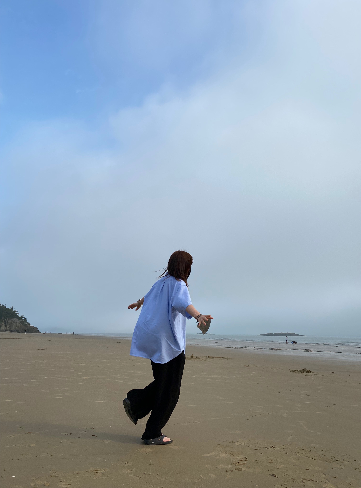
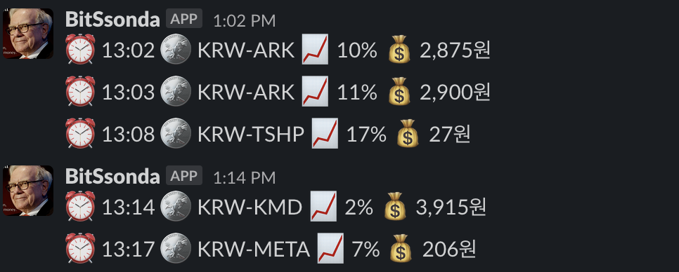
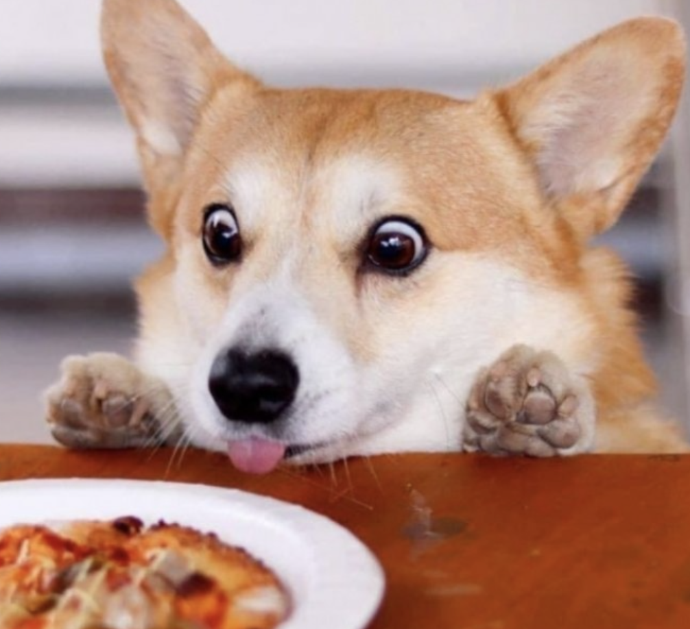
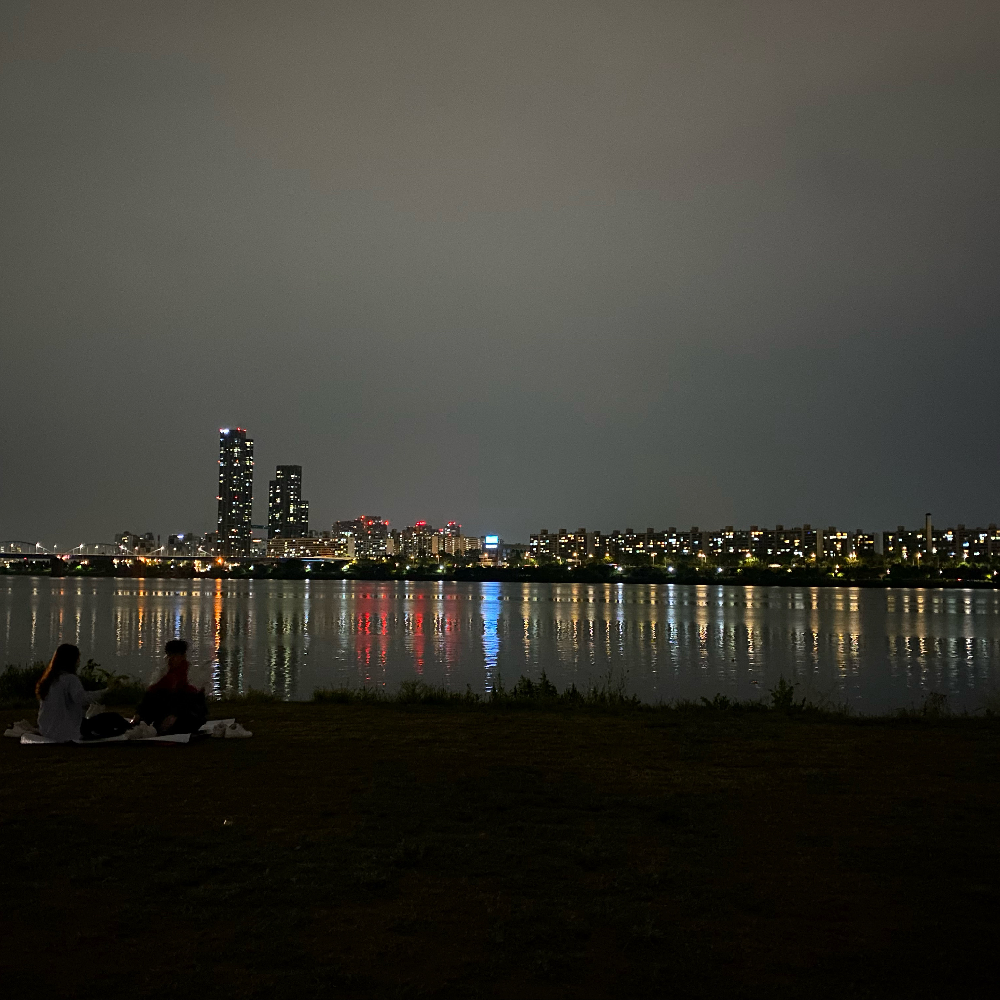

반팔에 반바지를 입고 출근해도 헥헥거리는 걸 보고 정말 여름이 오긴 왔구나 싶었다.

어느덧 26살의 절반이 갔다. 더 늦기 전에 2021년 상반기 회고를 해보려 한다.

## 봄바람 휘날리며

팩트부터 말하면, 5~6월은 고삐 풀린것 마냥 좀 놀았다 ^____^z

올 초부터 평일 야근에 주말에는 개인 프로젝트 혹은 공부를 하느라 코딩에 빠져 살았는데 날씨탓인지.. 맑은 하늘만 보면 나가고 싶어서 정말 나가 놀았다.

바깥 바람도 쐬고 사람들도 만나고 하니 스트레스도 줄어들고 마음이 편-안해졌다.

이제 다시 우중충한 날씨가 되었으니 마음을 다잡기 위해 포스팅을 한다! 헤헤

## 코인... 그게 뭔데

[BitSsonda](https://github.com/ugaemi/BitSsonda)는 2시간(?)만에 만든 아주 간단한 실시간 상승 코인 알림 슬랙 봇이다.

코인장이 한참 재밌을 때 가지고 좀 놀다가 지금은 다시 주식으로 돌아왔다.
카카오만 보면 마음이 편안해진다..카카오 사랑해!

## 미궁속으로 빠진 프로젝트들

현 회사에 재직한지도 벌써 1년하고도 5개월이 흘렀다.

작년까지는 대부분의 리소스를 그룹웨어에 쏟았었는데 올해는 그룹웨어가 아닌 다른 프로젝트들을 위주로 진행하게 되었다.
개인적으로는 그룹웨어를 좀 더 디벨롭하고 싶은 마음이 컸는데 그와는 달리 내부적으로도 변화가 참 많은 시기였고 그 영향이 우리 팀에게도, 또 나에게도 직접적으로 오게 되었다.

작년, 사내 및 계열사 브랜드를 동시에 런칭하게 되면서 각 브랜드 사이트의 서버 호스팅과 쇼핑몰을 관리하게 되었다.

그 덕분에 커머스 도메인을 처음 접하게 되었는데

- 고도몰 솔루션 php 코드 커스텀
- Django Admin CMS 구축 및 쇼핑몰 홈 API 연동
- django-rq를 활용해 카카오 알림톡 전송하기
- Google Analytics & Google Tag Manager E-commerce

등을 경험할 수 있었다.

모두 처음 경험해 보는 것들이어서 어려운 부분도 많았지만 지나고나니 언제 이런 경험을 또 해볼까 싶긴했다.

이와 비슷한 시기에 신규 플랫폼 개발을 맡게 되었다.
담당자였던 사수님이 작년 말 퇴사하시게 되면서 자연스레 내가 개발 컨텍 포인트를 맡게 되었고 그로 인해 UI / UX 디자이너분들과 제대로 된 협업을 처음 해보게 되었다.
레퍼런스라 할만한 서비스가 없는 플랫폼이다보니 설계부터 1년정도가 걸린 프로젝트였고 DB 구조도 매우 복잡한 프로젝트였다.
프론트와 백엔드 둘 다 개발해야 하는 와중에 함께 개발하는 백엔드 개발자분이 한 명이 전부여서 사실상 개발 자체가 어려운 프로젝트였는데 베타 오픈까지 매일 야근해가면서 참 열심히 했던 것 같다.

결론은 올해 상반기동안 80%에 달하는 리소스를 이 두 프로젝트에 모두 쏟았는데 둘 다 내부 사정으로 중단 된 상태이다.
개인적으로 힘이 많이 빠진 시기였다... 아마 지금도(?)
들어간 리소스 대비 결과가 좋지 않아 최근에는 참 무기력하게 회사 생활을 했던 것 같다.

## 첫 후임이 생겼다

올해 4월에 첫 후임이 생겼다!

후배의 소개로 데리고 왔는데 신기하게도 여러모로 연관이 참 깊은 친구다.
무엇보다 애완동물로 코기를 키우는데 그걸 듣고 운명인가? 싶긴 했다.

첫 후임인지라 알려주고 싶은 것, 도와주고 싶은 것들이 참 많은데 어떻게 해야 좋은 사수가 될 수 있을지 잘 모르겠다.
그럴때마다 작년에 퇴사하신 데브숩(이하 좋은 사수의 표본)님이 떠오른다.. 큽

지난 사수님들을 보며 개인적으로 느낀 **좋은 사수의 특징**은

- 요구사항은 항상 좋은 레퍼런스들과 함께 던져준다.
- 포기하고 싶을 만큼 어렵지도, 얕볼만큼 쉽지도 않은 적절한 이슈를 준다.
- 일을 주기 전에 먼저 어떤 걸 하고 싶은지 물어본다.
- 정답을 알려주기 보다는 정답을 찾을 수 있는 방향을 제시해준다.
- 잘한 부분에 대해서는 아낌 없는 칭찬을, 아쉬운 부분에 대해서는 빠짐 없는 피드백을 준다.
- 일을 시작하기 전에 이 일을 왜 해야 하는지 히스토리를 잘 알려준다.
- 맛있는 걸 잘 사준다.

이 정도 인 것 같다. 쉬워보이지만 참 어렵다.

지금 나에게 내가 좋은 사수인것 같냐고 물어본다면 반은 맞고 반은 아직 멀었다고 생각한다.

나도 내가 생각하는 사수님들처럼 누군가에게 좋은 기억으로 남는 사람이 됐으면 좋겠다 🙂

## RCOD JS 스터디 마무리

[33-js-concepts](https://github.com/leonardomso/33-js-concepts)를 주제로 한 챕터씩 정리하며 발표하는 스터디가 마무리되었다.

벌써 이들과 함께한지 3년째인데, 생각보다 스터디를 잘 유지하는 것 같아 신기하기도 하다.
일단 이사람들이 다같이 개발자로 밥벌어먹고 산다는것부터 신기하긴 하다 ㅋㅋㅋㅋㅋㅋㅋ

아무튼 예상 일정보다 2배는 길어진 것 같지만, 마무리를 지었다니 참 뿌듯하다.
다음엔 또 어떤 주제로 스터디를 하게 될지 모르지만 친구들과 이런 그룹을 만들어 소통할 수 있다는 것 자체가 좋다.

## 사이드 프로젝트

우연한 기회로 사이드 프로젝트를 시작하게 되었다.
그간 시도했던 많은 사이드 프로젝트들은 시작도 전에 이게 얼마나 갈까? 하는 막연한 걱정부터 들었는데, 이번 프로젝트는 좀 다르다.
쉽게 모을 수 없는 포지션의 멤버들로 구성된 그룹으로, 당장은 오픈하기 어렵다.

올해 4분기 1차 오픈을 목표로 달리고 있는데, 요즘 이 프로젝트 개발하는 맛에 사는 것 같다.
로또처럼 행복회로를 돌리게 만드는 사이드 프로젝트...❤️

오픈 후 회고를 작성할 날이 빨리 왔으면 좋겠다!

## 🐝

올 상반기를 생각하면 절대 빼먹을 수 없는 일이 하나 있는데.. 비밀이다 👻

## 하반기 계획

블로그는 개인적이면서도 오픈된 공간이라 내 모든 생각을 적어두긴 어려울 것 같다.

최근에 고민이 생겨서 하반기 계획을 어떻게 세우는게 좋을지 주변에 의견을 구해봤는데 나름 빠르게 잘 정리된 느낌이 든다.

늘 해오던 대로, 내 생각대로 하면 될 것 같다.

구체적인 목표는 적지 못하지만 하반기 회고에는 이번보다는 무조건 더 좋은 결과를 들고 올 수 있도록 해야겠다!

그럼 내일도 화요팅~ 💪🏻

