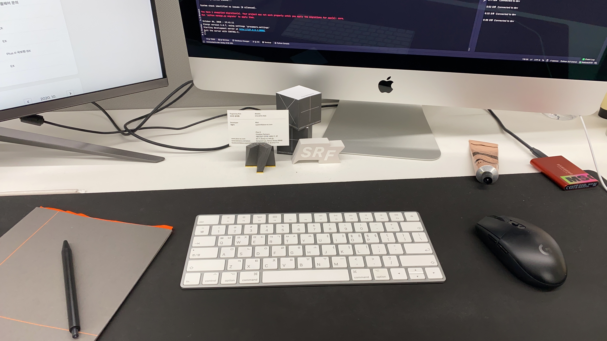
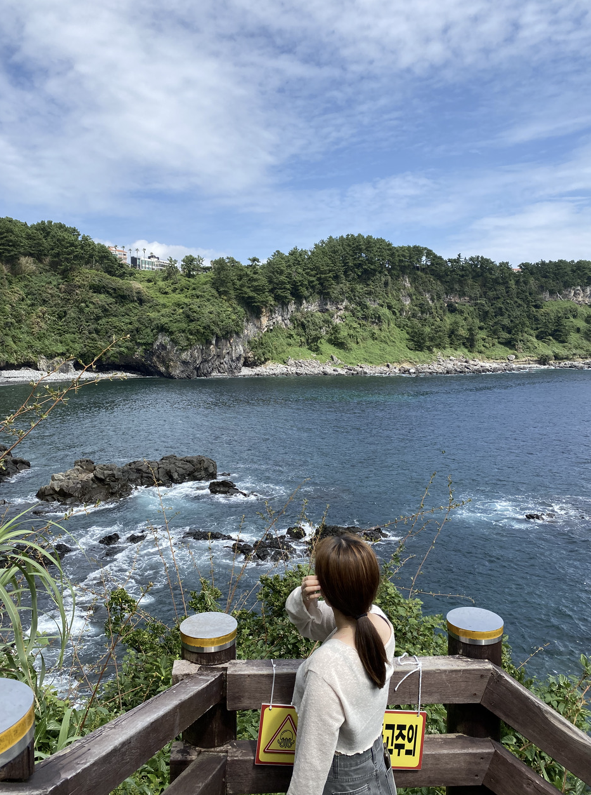
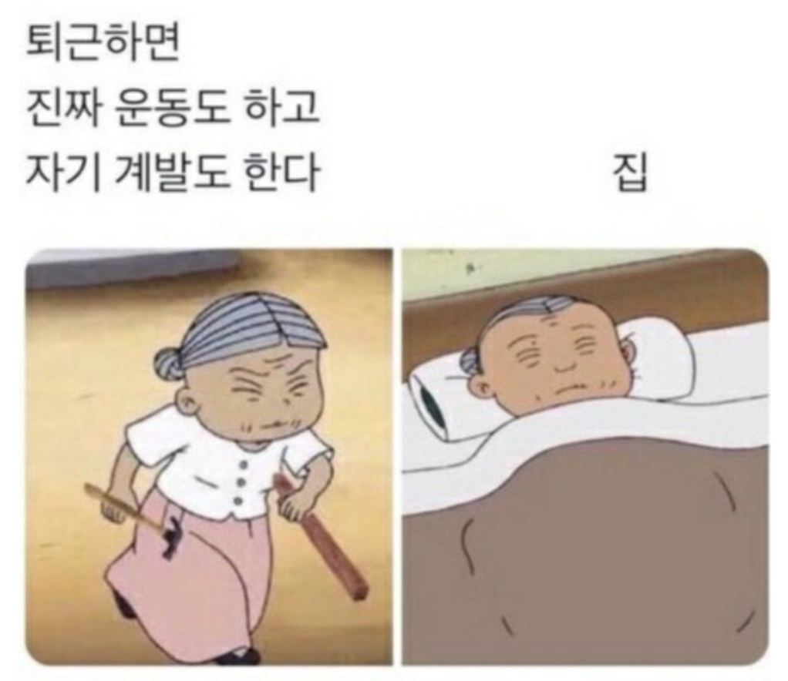
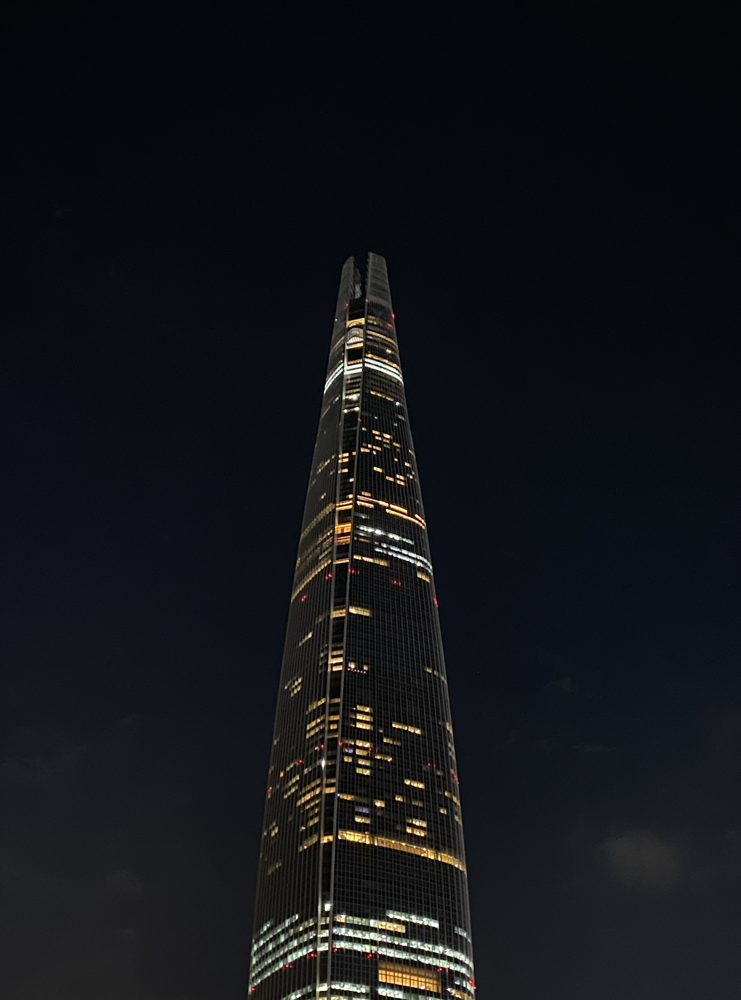
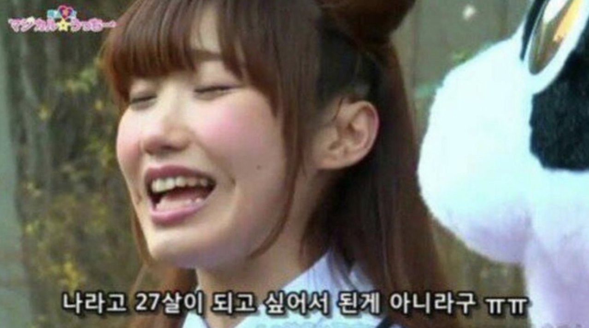

회고가 늦었다. 연말에 사이드 프로젝트하랴 영상 편집하랴 좀 많이 바빴다.

벌써 새해가 밝은지 일주일이 지났다.

나에게 얼마 남지 않은 J(이하 MBTI)를 열심히 쥐어짜내어 나름의 OKR도 세워보고 생활 루틴도 만들어보고 있다.

올해 계획을 더 끄적이기 전에 지난 2021년 하반기에 대한 회고를 해보고자 한다.

## +x 안녕

2021년 8월, 나의 세번째 회사였던 플러스엑스를 1년 9개월만에 떠났다.

정말 존경하고 좋아했던 이사님과 정들었던 팀, 그리고 애정 가득한 그룹웨어 프로젝트를 떠나기가 좀 많이 아쉬웠다.

사실 떠나면서도 몇번이고 내 선택에 의문을 가졌었고, 실제로 나와서도 고민을 많이 했었다.

퇴사를 하고 나서 심적으로 이렇게까지 힘들었던 적은 처음이었던 것 같다.

하지만 그 당시에는 불안정한 미래가 너무나도 두렵게 느껴졌다. 정체되어 있는 느낌을 많이 받았다.

확실한 것은 회사에 있는 동안 내가 예상한 것보다 훨씬 더 많이 성장했고, 이제는 내가 하고 싶은 것에 더 집중할 수 있는 환경으로 가서 완전하게 점프업을 해야할 때라는 생각이 들었다.

그렇게 두어달을 고민하다가, 지금의 회사에서 포지션 제안이 왔을 때 마음을 굳히게 되었다.

퇴사를 하던 날이 아직도 생생하다.

짧으면 짧고, 길다면 긴 1년 9개월의 시간동안 플러스엑스는 나에게 참 많은 것을 가르쳐주었다.

앞으로는 겪기 힘들 신선했던 경험들, 멋진 프로젝트, 그리고 좋은 동료들까지!

이 글에 모든 마음을 담아내긴 부족하지만, 늘 감사히 생각하고 있다. 🙏🏻

## 제주여행과 루미튜브

입사가 확정되고는 퇴사를 일찍 해버렸다.

졸업 전부터 인턴으로 취직을 해서 바로 사회생활을 시작한 나로써는 언제 다시 올지 모를 꿀같은 휴식을 놓칠 수가 없었다.

휴식기에는 전부터 가고 싶었던 제주 여행을 떠났다.

원래는 혼자 여행을 떠날 계획이었는데, 마침 루피도 가고싶다고 하길래 둘이 가면 더 재미있을 것 같아 그렇게 둘이서 가게 됐다.

그렇게 탄생하게 된 루미튜브!

전부터 유투버로서의 욕심이 있었던 루피와 채널을 만들어 제주 여행 하루하루를 올리기 시작했다.

영상 편집이라면 중학생 때 친구들 생일 축하 영상을 만들어본 게 전부인데, 브이로그 영상을 만들기가 쉽지는 않지만 나름 흥미로워서 아직까지도 꾸준히 해오고 있다.

처음 목표보다는 슬슬 밀리는 감이 없지 않아 있는데 너무 빠듯하게 하면서 금방 지치기보다는 여유를 가지고 천천히 내 일상을 공유하려고 한다.

## 자기계발

GIT 멘토링과 외주를 했던 게 기억에 남는다. [GIT 멘토링에 대한 글](https://ugaemi.com/retrospect/GIT-AWS-Mentoring/) 은 포스팅한 적이 있어 넘어가 보겠다.

이번 외주는 총 5명이서 프로젝트를 하게 됐다. 외주 경험은 세번째인데, 기획자와 디자이너 그리고 프론트 개발자까지 완전한 팀 체제로 해 본 건 처음이었다.

백엔드 개발은 거의 혼자 전담하게 되어서 부담스러운 부분이 없지 않았지만 주변 분들이 많이 도와주셔서 성공리에 마무리하게 됐다.

놀랍게도 외주는 할 때마다 다신 안하겠다는 다짐을 하는데, 잔금일이 되어 자본주의의 맛을 보면 금세 잊혀진다ㅎ

그래도 당분간은 안할 것 같다.. 차라리 개인적으로 만들고 싶은 프로젝트를 해보거나 신기술 공부를 하는 것이 이너피스에 도움이 될 것 같다.

## 새로운 보금자리로의 출근

엊그제 입사한 것 같은데 벌써 3개월이 지나 수습 기간이 끝났다. 며칠 전엔 3개월 피드백 면담도 가졌다.

입사 전 온보딩 페이지를 구경할 때만 해도 *아 3개월 어떻게 버티지..* 하는 걱정을 했었는데 눈 깜짝할 새에 지나버렸다.

입사 초반에는 경력자라면 누구나 그렇듯이 내가 여기서 과연 얼마나 성장할 수 있을까? 와 같은 고민이 많았다.

헌데 지금은 걱정에 가까운 고민보다는 팀의 상황을 어떻게 더 개선하고 성장시킬 수 있을까에 대한 고민이 많아졌다. 이렇게 변하게 된데에는 *이렇게 된거 긍정적으로 생각하자*는 마인드와 온보딩 피드백 시간이 컸다.

1.5개월 피드백 면담 때 부문장님에게 개인적으로 아쉬운 점을 몇 가지 말씀드렸었는데, 타협이 가능한 부분에는 내 의견을 적극 반영해 주신 부분도 있었고 느리지만 조금씩 개선되는 부분도 있었다.

그 외에 내가 나서서 해결할 수 있는 부분은 적극적으로 개선하려 하고 있고, 앞으로도 그럴 계획이다.

## 어느덧 20대 후반...

만나이 표준화는 언제 되려나? 어쨌거나 보편적인 나이로는 벌써 27살이 되었다.

올해는 문득 어른스러워져야겠다는 생각이 들었다.

좀 더 정확히 표현하자면 어른스러움보다는 **프로페셔널한 사람**이 되어야겠다.

외적인 모습부터 내면까지 한층 더 업그레이드 해야 할 시기가 온 거다.

*예전의 나는 철없고 솔직했으니 변해야해!* 이게 아니라, 격식있는 자리에는 격식있게 옷을 입는 것처럼, 사회에서도 더이상 신입사원이 아니니 그에 맞는 프로다운 면모를 보여줄 때란 말이다.

MBTI가 ENFJ에서 INTP로 무려 3자리가 변했다. 이에 따라 패션 취향이나 관심사도 많이 변한 것 같다.

긍정적이든 부정적이든 나라는 사람이 근 몇 년 사이에 참 많이 변했다고 느꼈다. 주변에서도 그런 이야기를 자주 들었다.

2022년에는 본래 모습 중에 잃고 싶지 않은 부분은 지켜내는 노력을, 부족한 부분은 채워나갈 노력을 해야겠다.

올해 상반기에는 더 풍부하고 재미있는 회고를 들고 오길 기대하며 글을 마친다.
