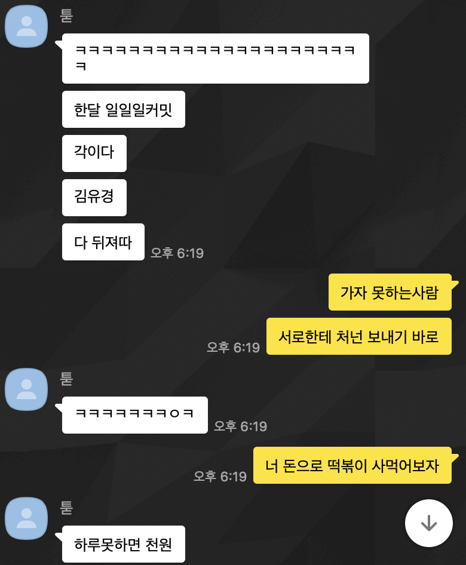
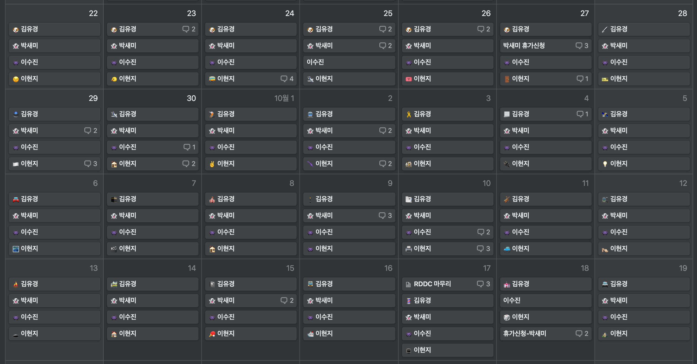
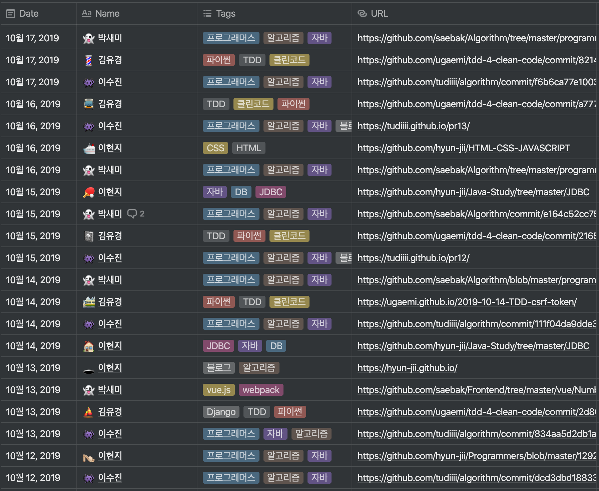
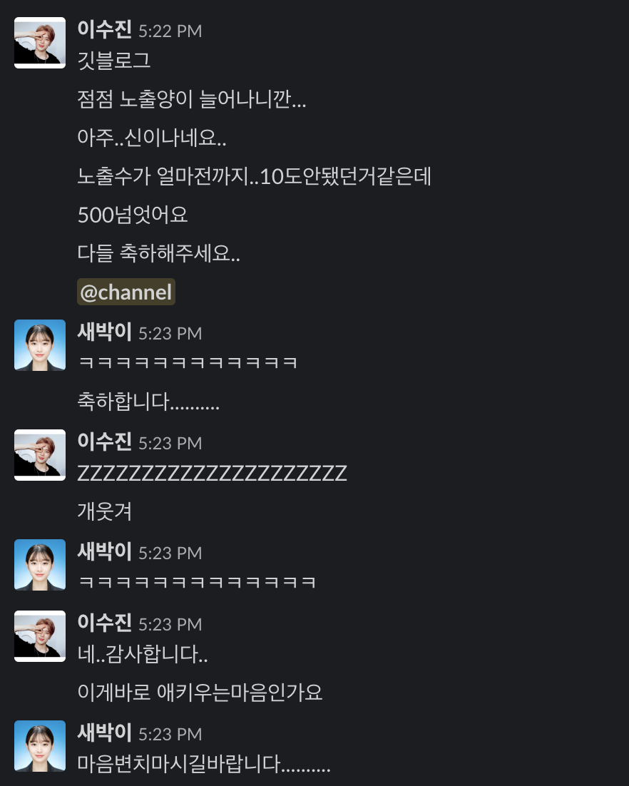
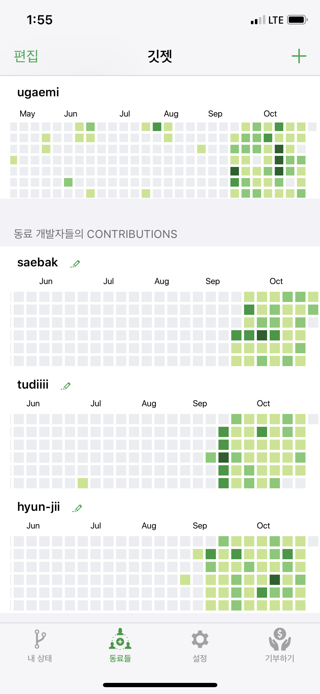

## 미미 했던 시작

시작은 참 별거 없었다. 레알크루 톡에서 친구들과 신나게 떠들다가 갑작스레 시작된 일일 커밋에 대한 내기.

처음에는 [투디](https://github.com/tudiiii)랑 1:1로 붙으려다가 [현젼](https://github.com/hyun-jii), [새바기](https://github.com/saebak)까지 함께 하기로 했다.
그렇게 탄생한 개발 그룹의 이름은 RDDC (투디가 네이밍했지만 부끄러워서 풀네임은 안적음)
목표는 **한 달동안 일일커밋하기**였다.
텅텅 비어있는 내 Github의 아스팔트에 파릇파릇한 잔디를 심어보자! 다짐했다.

## 일일 커밋 깨알 규칙

### 1. Notion에 커밋한 URL 올리기. 공개적으로 볼 수 있어야 하므로 무조건 Public Repo

우선은 [Notion](https://notion.so) 페이지를 하나 팠다. 오늘 누가 커밋을 안했는지 쉽게 감시하기 위한 방편이었다.

커밋 URL을 직접 넣어주기 때문에 친구들의 Github Repo에 바로 들어가기가 수월했다.
또 커밋한 내용에 대한 태그도 넣어주어서 친구들이 오늘 무슨 공부를 했는지 한 눈에 파악하기가 쉬웠다.

### 2. 의미없는 커밋은 No! 쉬운 문제라도 자기 힘으로 풀기

무조건 잔디를 심는 것이 우리의 목표는 아니었다.
단 30분이라도 매일 꾸준히 공부하는 습관을 만드는 것이 최종적인 목표였기 때문에, 그저 글자 하나만 바꿔서 올리는 의미없는 커밋은 인정되지 않도록 했다.
두 명이 아니라 네 명이 같이 하다보니까 서로 감시(?)가 잘되어서 나쁜 커밋을 할 일은 없었다 ㅋㅋㅋ

### 3. 어떠한 사정으로 도저히 커밋이 힘들 경우 휴가신청

새바기는 회사원이기 때문에 다른 친구들처럼 시간이 많지가 않았다. 물론 시간을 쪼개서라도 커밋하는 것이 목표지만, 솔직히 회사원에게 일일커밋은 그리 쉬운 일이 아니다.
그렇기 때문에 피치 못할 사정이 있는 경우에는 서로 합의 하에 휴가를 낼 수 있도록 해주었다.
하지만 이 규칙은 거의 사용되지 않았다. 그만큼 친구들이 생각보다 열심히 해주었다.

### 4. 오늘 잔디를 심지 못했다면? 친구들에게 각각 천 원씩 입금 ㄱ

사실 일일 커밋 내기를 시작하고, 생각보다 수금이 쏠쏠할 것이라고 생각했다.
그러나 예상과는 정반대로 한 달이 끝날때까지 단 한푼도 받지 못했다. (나는 한 번 냈다. 따흑)
한 푼도 못받았지만 그래서 더 기쁘다. 친구들이랑 무언가를 끝까지 해냈다는 사실이 더 좋았다.

### 5. 블로그 포스팅도 커밋으로 ㅇㅈ

포스팅이 생각보다 시간이 오래 걸린다. 나도 친구들도 블로그에 코드만 올리는 일은 하지 않기 때문에 이 규칙을 만들게 되었다.
하지만 이 규칙도 사실 의미가 없는게 다들 잔디에 빵꾸나는게 싫다면서 블로그 포스팅도 하고 따로 커밋도 했다.. 정말 대단한 친구들이다.

### 6. 소통은 Slack에서

질문을 할 때 코드를 올리는 경우가 종종 있는데 카톡으로 소통하기에는 가독성이 좋지 않아 마크다운 형식을 지원해주는 [Slack](https://slack.com/intl/en-kr/)에 채널을 만들었다.

개발 관련 이야기를 하거나 모각코 일정을 잡을 때 아주 유용하게 썼다.
또 Github과 Notion 연동으로 알림을 통해 커밋 로그를 바로 볼 수 있게 했다.

## 한 달이 지나고

나름 1.5평 정도의 잔디가 심어졌다 ㅋㅋㅋ
친구들과 나의 잔디 상황을 한 눈에 볼 수 있도록 만들어진 앱인 [깃젯](https://apps.apple.com/kr/app/%EA%B9%83%EC%A0%AF/id1317170245)은 일일 커밋 내기를 할 때 아주 유용하게 쓰였다! (깃젯 개발자님들 감사합니다.)

## 좋았던 점

### 1. 공부가 습관으로

퇴사 후에 꾸준히 공부를 해오긴 했지만 혼자 공부 하다보니 마음이 붕 떠버리는 날들이 있었다.
그런 날들을 이번 일일 커밋 내기가 다잡아준 것 같다.
초반에는 *커밋해야되는데*였다면 요즘은 *커밋해야지*가 되었달까?
저녁에 약속이 있는 날이면 아침에 눈뜨자마자 커밋을 했다. 하루 종일 일정이 있는 날이면 새벽에 잠도 안자고 커밋을 했다.
잔디를 심는 일이 습관이 되어버리니 내기에 대한 부담감도 사라졌다.
친구들도 이 말에 모두 동의했다. 내기를 통해 얻은 가장 큰 수확이다.

### 2. 친구들과 함께하는 생산적인 이야기

슬랙 채널을 만든 후, 자연스레 카톡에서는 일상 이야기를 공유하고 슬랙에서는 개발적인 이야기를 주로 하게 되었다.
친한 친구들과 개발 이야기를 주고받으니 편하고 재미있었다.

### 3. 우리가 모각코를 하다니

처음으로 모각코를 하자는 소리가 나왔다.
한 달 동안 두 번 정도 만나서 모각코를 진행했는데 만나서 수다도 떨고 같이 공부하니 정말 재미있었다.
앞으로도 가끔씩 만나서 모각코를 하기로 했다. 신난다.

## 아쉬웠던 점

### ~~1. 증발해버린 Private Repo~~

수정) Private Repo는 잔디가 안심어지는 줄 알았는데 Contribution Settings에서 체크를 해주면 보인다! 하핫

### 2. 쉽지 않은 코드 리뷰

토이 프로젝트나 알고리즘 풀이를 할 때 서로 코드 리뷰도 해주면 좋겠다! 라고 생각을 해서 제안을 했으나 쉽지 않았다.
나는 파이썬이 주 언어이고 나머지 친구들은 자바이다보니 풀이 방식에 대한 논의는 할 수 있을 지언정 코드 자체에 대한 리뷰를 하기에는 서로의 실력이 부족했다 ㅠ

## 새로운 목표

다들 공부하는 것이 습관이 되었기 때문에 앞으로는 일일 커밋에 대한 터치는 하지 않기로 했다.
대신 좀 더 스터디스러운(?) RDDC가 되고자 한 가지 제안을 했다. 바로 웹 프로그래밍에 대한 스터디였다.
네 명 모두 웹 백엔드 개발자를 목표로 공부하고 있기 때문에 그에 대한 지식을 함께 쌓아가고 싶었다.
고맙게도 나머지 세 명이 모두 동의를 해주어서 이번 달부터 진행할 계획이다. 화이팅!