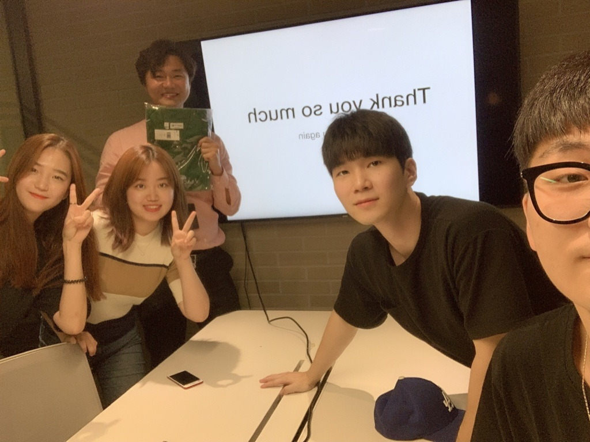

약 반년 간 함께했던 [DevTycoon](https://github.com/ugaemi/programming_note) 개발 스터디의 마지막 모임을 했다. (롬곡옾높...)
각자 지난날들의 회고와 앞으로의 방향, 그리고 자신의 목표와 계획을 발표하는 시간을 가졌다.
발표를 준비하며 작성했던 PPT의 내용으로 짧게나마 회고록을 쓰려고 한다 :D

## 첫 만남

이미 나를 제외한 기존의 멤버들은 반년 정도 먼저 스터디를 진행 중이었다.
2018년 하반기 즈음 나는 인턴십 프로그램에 참여한 상태라 정신이 없었다;
사실 뎁타의 리더 종호 님과는 딱히 연락할 일이 없었다. (신입생 때 선배님은 이미 졸업..ㅎ)
그럼에도 불구하고 이 스터디에 참여하게 된 계기는 다름 아닌 인스타그램 스토리였다.
한창 (새단장을 하기 전) 블로그에 포스팅을 하면 캡처해서 스토리에 올리곤 했는데, 우연찮게 종호 님이 내가 올린 스토리를 보고 DM을 주셨다 ^ㅁ^ 데헷
그렇게 인연이 닿아(?) 자연스럽게 선배님이 진행하는 스터디에 관한 이야기도 듣게 되었고, 또 그 스터디에 참여하고 싶다는 마음이 들었다!
무엇보다 스터디 구성원들이 모두 친한 동기와 선배들이었기 때문에 더더욱 들어가고 싶은 조건이었다.

## 스터디 활동

내가 참여할 즈음에는 나도 이직을 준비하고 친구들도 취업을 준비할 때여서 자연스럽게 취준 스터디가 되었다.
취업 준비를 할 때의 DevTycoon 활동은 크게 다음과 같았다.

- 알고리즘 문제 풀이와 코드 리뷰
- 이력서 작성
- 면접 후기 공유
- 자유 주제 발표

알고리즘 문제 풀이는 [Programmers](https://programmers.co.kr/)나 [Codility](https://www.codility.com/) 등에서 자신이 원하는 문제를 자유롭게 푸는 방식으로 진행되었다.
자신의 이름으로 된 브랜치를 만들고 푸시한 후에 PR을 때리면(?) 모두가 코드를 보고 리뷰를 해주는 식이었다.
제대로 된 정보를 얻어가는 리뷰도 많았지만 흥미로웠던 점은 서로 문제를 풀어낸 언어가 달라서 애를 먹었다는 점(?) ㅋㅋㅋ
알다시피 나는 파이썬을 주 언어로 하고, 유디와 석선은 자바 그리고 승이는 노드여서.. 그야말로 대환장파티
서로의 코드를 신기해하느라 여념이 없었다고 한다.
물론 이외에도 혼자 했을 때와는 다른 점이 있다. 바로 테스트 코드를 작성했다는 것이다.
TDD에 대해서는 전 회사에서도 잠깐 배운 적이 있어서 개념이 무엇인지는 어느 정도 알고 있었으나 실제로 써먹어 본 적은 없었는데, 종호 님께서 무료로! TDD에 대한 고액 강좌를 해주셔서 알고리즘 문제를 풀 때에라도 적응해보고자 연습했다. 정말 좋은 기회였다.

이력서 작성 부분은 패스하겠다. 이 부분은 리더님께서 멱살 캐리 해주셨다. 정말 감사드린다.

면접 후기 공유는 스터디 협업 툴로 사용하는 [Notion](https://notion.so)에서 이루어졌다.
짧게나마 회고를 작성하고 공유하는 식이었다.
사실 취업 준비라는 건 누구에게나 상당히 조심스러운 부분이다.
자신의 경험을 나누는 것 자체가 어찌 보면 굉장히 부끄러울 수도 있다. (케바케지만)
하지만 우리 스터디 구성원들 모두 긍정적인 마인드의 소유자라 자신의 상처 따위 웃음으로 승화시키며 나름 행복하게 취준 했던 것 같다.

스터디 팀원들과 대단한 프로젝트를 하거나 공모전을 준비하는 등 엄청난 활동을 하진 않았지만 소소하게 근황 토크를 하는 것만으로도 취업 준비를 하는 데에 있어서 정말 큰 위로가 되었다.
특별한 것은 없고, 비슷한 상황의 친구들이 모여 있었기 때문에 가능했던 일인 것 같다 :)

올봄에는 드디어 뎁타 구성원 모두 다 취업에 성공했고 스터디가 새로운 막을 시작하게 되면서 활동이 크게 달라졌다.

- 근황 토크
- 개발 일지 공유
- 자유 주제 발표
- MSA 프로젝트

각자 회사가 다르고 포지션이 다르고 사용하는 언어가 다르다 보니 막상 만나면 스터디를 어떻게 진행해야 할지 막막했다.
그래서 생각하게 된 것이 바로 개발일지이다.
**TIL(Today I Learned)** 과 같은 개념인데, 개발을 하며 얻게 된 지식을 자신의 개발 일지에 적고 함께 공유하는 것이다.
별거 아니라고 생각할 수 있지만 개발일지가 나는 뎁타의 가장 큰 이점 중 하나라고 생각된다.
친구들이 어떤 개발을 하고 있는지 관심 있게 들여다볼 수 있고 서로 동기부여도 되어 더 열심히 개발하고 싶어 지게 만든다.
이처럼 서로의 개발 일지에 조언이나 생각 등을 댓글로 남기면서 의논하기도 한다.
스터디는 중단되었지만 개발 일지 공유는 계속하자는 멤버들의 의견으로 여전히 작성 중이다. (뿌듯)

이외에도 자유 주제 발표 등 스터디 활동은 전보다 훨씬 자유롭고 주체적으로 진행되었다.
MSA 프로젝트도 시도해보았지만 바쁜 일정 탓에 수포로 돌아간 적도 있다... (실패는 성공의 마덜)

## 스터디 잠정 중단

리더님의 사정으로 우리 스터디는 잠정 중단 상태가 되었다.
비록 월간 모임과 슬랙에서의 시끌벅적한 이야기들은 잠시 접어두게 되었지만, 스터디를 쉬게 되었다는 것이 우리에게 나쁜 소식은 전혀 아니다. 더 나은 목표를 위한 도약일 뿐!
각자 어느 정도 성장해서 다시 만나기로 했다.

## 스터디를 통해 얻게 된 것들

나열하기엔 너무 많다.
짧은 시간이었지만 멤버들과 이런저런 이야기들을 하면서 영감을 얻은 적이 정말 많았다.
스터디가 사정상 잠정 일시중지 상태가 되었지만 언젠가 다시 만나게 될 날을 기다리면서 모두 다 파이팅하길!

Forever DevTycoon ❤️
