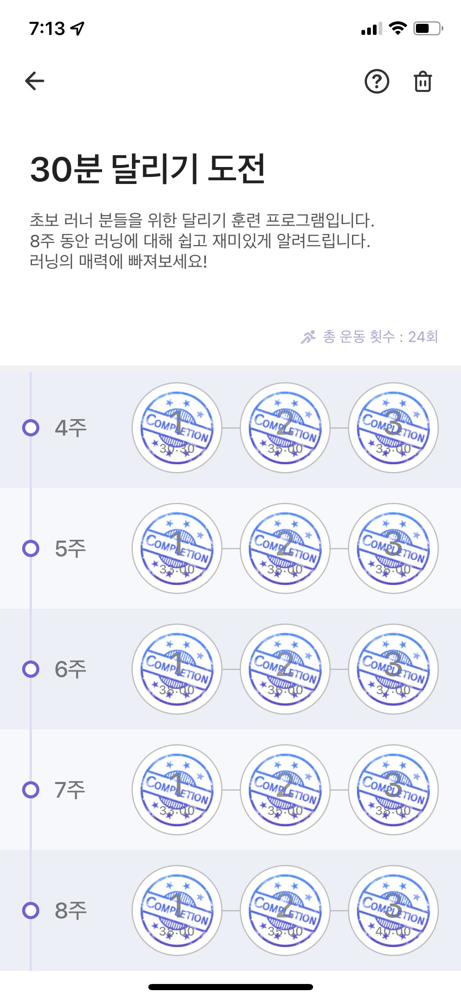

2022년은 전반적으로 무난한 해였다. 라고 말할 수 있는건 예상에 없던 크고 작은 이벤트들을 경험했지만 어느 때보다 더욱 나에게 집중하고 중심을 잃지 않으려고 노력했기 때문이라고 생각한다.
분명 내면의 성장을 이뤄낸 갚진 시간들이 있었고 지금의 나는 과거의 나보다 훨씬 단단해졌다는 것을 느낀다.

그래서 어느때보다 가벼운! 마음으로 작년 한 해 이슈들을 차근차근 적어보려고 한다.

## 미라클 러닝

올해 초, 새벽 러닝을 시작해보자는 친구의 제안이 있었다.
새해 버프로 흔쾌히 제안을 수락하긴 했지만 늘 그래왔듯 일주일 넘기기는 어렵겠다는 생각을 했다.
어두운 겨울 새벽 5시에 일어나서 5km를 뛰고 돌아와 씻고 출근할 용기가 없었다.

하지만 예상 외로 우리의 약속은 꽤 오래 지속되었다.
단 한번도 성공해본 적 없었던 런데이 30분 달리기 도전 8주 코스의 마지막 도장을 찍었기 때문이다.
5분 달리기도 심장이 터질 것 같았던 내가 30분을 뛰었다니! 믿기지가 않았다.

그렇게 우리는 러닝이 취미가 되었고 기분이 좋은 날이든 스트레스 받은 날이든 함께 뛰곤 했다.
지금은 아쉽게도 이사를 오게 되어 각자의 위치에서 다른 운동을 하고 있지만, 2022년에 친구와 이뤄낸 새벽 러닝의 쾌거는 나도 무언갈 해냈다는 자신감과 더불어 나를 더 사랑할 수 있게 만들어준 소중한 경험이었다.

## 사내 해커톤 참가

처음으로 열린 사내 해커톤에 참가하게 되었다.
과거 MBTI 테스트 프로젝트에 참여해 본 경험을 살려 커스텀 테스트 페이지 제작 서비스를 주제로 서비스 기획 및 발표를 담당해 무려 전체 2등!을 하게 됐다.
우리팀과 비슷한 서비스로 발표한 팀이 있었기에 입상까지는 기대하지 않았는데, 기존 서비스와 연결하여 임팩트를 내는 부분이나 페이지를 직접 구현한 부분에서 조금 더 높은 점수를 주신 것이 아닌가 싶다.

첫 해커톤에 좋은 결과를 얻게 되어 기뻤다. 상금으로 팀원들과 맛있는 저녁 식사를 했다.
개발자로서 해커톤에 꼭 한번 나가보고 싶단 생각이 있었는데, 구성원을 위한 의미있는 시간을 제공해준 회사에 감사했다.

## 취미는 짐싸기이고요, 특기는 이사입니다.

아무래도 역마살이 낀 사주인 듯 하다.
어린 시절 좁디 좁은 고향에서도 이사를 굉장히 많이 다녔다. 초등학생 때 전학을 두 번이나 경험한 사람은 흔치 않을 것이다.
대학교는 본가와 260km나 떨어진 곳에 다녔고 자연스레 자취를 하게되니 대학가 안에서도 이사를 자주 다녔다.
첫 회사는 아무런 연고도 없는 수원에 위치해 있었고, 외로운 8개월을 보냈다.
서울에 올라와서는 계약을 1년 단위로 하다보니 계약 만료 시점에 더 나은 조건의 집을 찾을 때마다 이사를 했다.

이번 집은 운 좋게 초역세권의 신축 오피스텔로 오게 되었다.
이전 집에 대한 애정이 남달랐기 때문에 선뜻 떠나기가 굉장히 아쉬웠지만, 막상 이사를 온 후로는 이곳의 인프라와 교통편에 너무나 만족하며 지내고 있다.

## 롯데타워 안녕

다음 거취를 정하지 않고 계획보다 빠른 퇴사를 하게 되었다.
퇴사 사유가 명확하기도 했고 메인 이슈 진행 도중에 퇴사를 하는 것보단 맡은 이슈를 모두 정리한 시점에 나오는 것이 팀에게 더 도움이 되는 방향이라고 생각이 되었기 때문이다.

퇴사를 하게 된 이유는 첫째로, 새로운 도메인을 경험해보고 싶었다.
2년 넘게 HR 도메인(출퇴근, 전자결재)을 개발 및 유지보수 해온 경험이 크게 전문적인 스킬을 요구하지 않아서 추후 커리어에 큰 도움이 되지 않겠다는 생각이 들었다.

물론 SaaS 신규 기능 설계 및 개발과 유저들과 채널톡으로 직접적인 소통을 하며 대응해 온 경험은 만족스러웠다.
또한 매일 방문하는 활성 유저 수가 꽤 많은 서비스를 처음으로 운영하게 된 점이 가장 큰 수확이었다.

두번째 사유는 공유와 피드백이 활발한 분위기 속에서 일하고 싶었다.
경험상 이런 분위기를 가진 팀에서 내가 훨씬 빠르게 성장할 수 있었다.

이런 니즈를 모두 충족시켜줄 회사를 찾기 위해 혹여라도 제안이 오면 무조건 커피챗을 먼저 진행했다.
면접 프로세스가 너무 짧거나 많은 이야기를 하지 않고 최종 합격을 하는 경우 오히려 상대방이 나의 어떤 부분을 보고 함께하고 싶은 건지 의문이 들 때가 있다.
팀에 대한 분위기나 입사 후 맡게 될 업무에 대한 충분한 정보를 듣지 못한 상태로 입사를 하게 되면 이른 퇴사의 확률이 높아지는 것 같다.
30분~1시간의 커피챗에서도 모든 것을 알아낼 수는 없지만 정해진 채용 프로세스가 너무 짧다면 인사담당자 혹은 함께 할 팀원분들께 커피챗을 먼저 제안드려보는 방법을 추천한다.

넥스트 스텝에 대한 이야기는 입사 후 써내려가보도록 하겠다.

## 스터디 리딩

나는 리더십이 있는 편은 아니다.
학창시절 리더를 해 본 경험은 반장 한 번, 연구실 랩장 한 번이 전부다.
대부분 다른 사람을 이끌어주기 보다는 리더의 의견에 따르는 역할을 많이 해왔던 것 같다.

여태 일해오면서도 리더십이 필요한 순간은 크게 없었다.
하지만 회사를 다녀보니 대표 한 명만이 리더인 것이 아니라, 회사는 수많은 리더로 구성되어 있다는 것을 새삼 느꼈다.
팀 리더와 프로젝트 리더, 더 작게는 한 명의 구성원을 이끌더라도 그 사람의 리더가 된다.
언젠간 예고없이 나에게도 기회가 찾아올 것이라고 생각했다.

연습 겸 만만한 스터디부터 리딩해보기로 했다.
RDB를 대부분 기본 데이터베이스 기술 스택으로 사용해왔지만 DB 서버 구성이나 쿼리 실행 계획 등에 대해 더 깊게 알고 싶어 Real MySQL 8.0 1권을 주제로 스터디를 오픈했다.

스터디원 5명은 모두 지인으로 구성되어 있고 개발자, 데이터 엔지니어, 기획자 등 포지션이 다양하다.
각자의 경험치나 눈높이도 조금씩 달라서 최대한 개념 설명을 쉽게 하자는 기조로 매주 발표를 진행하고 있다.

11월 초에 시작해 어느덧 이번주 마지막 발표다.
재직 중임에도 상당한 양의 발표 준비를 해오고 잘 따라와준 스터디원들에게 고마운 마음이 든다.

스터디에 대한 내용은 [링크](https://www.notion.so/Real-MySQL-8-0-1-439d277a7b4e40a79ecc8637c2fac945)를 통해 더 자세히 엿보실 수 있다.

## 도쿄 여행

코시국 이후 첫 해외 여행지로 도쿄를 방문했다.
반드시 가보고싶은 여행지 중 하나여서 선택을 한 건 아니었다.
남자친구와 처음으로 가는 해외여행이니 가까운 일본정도라면 부담이 덜할 것 같았다.
개인적으로 오사카는 두 번이나 다녀왔으니 패스, 그리고 남자친구가 후쿠오카를 다녀와봤으니 패스 ...
겨울의 삿포로가 더 끌렸지만 저렴한 비행편 때문에 최종적으로 도쿄를 선택하게 됐다.

간만에 다녀온 일본은 여전히 좋았다.
디즈니씨의 화려한 풍경과 도쿄역의 츠케멘이 가장 기억에 남는다.
앞으로는 자주 해외를 나갈 기회가 있었으면 좋겠다.

## 기대되는 2023년

작년 한 때는 인간관계와 커리어에 대해 굉장히 많은 고민을 했었다.
1년 전의 나라면 자책과 후회의 시간을 보냈겠지만, 지금은 그저 나를 응원해주고 싶은 마음 뿐이다.

2023년은 회고를 더 자주, 많이 하려고 한다.
자주 돌아볼수록 깊어진 의미들이 내 성장의 밑거름이 될 것을 확신한다.
올해는 더욱 활기차고 사랑하는 한 해가 되었으면 좋겠다.

모두 새해 복 많이 받으시고 행복하세요 🍀
