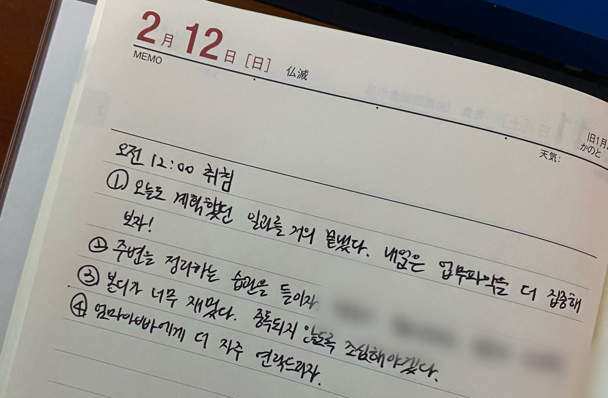

## 나는 누구인가?

문장 그 자체로 바라보자면 ‘태어나서 지금까지 내 몸과 영혼으로 살아온 나는 도대체 누구인가’에 대해 아주 수월하게 대답할 수 있어야 하는게 어찌 보면 당연하다.
이 심플한 질문을 받은 사람은 가족도 친구도 제삼자도 아닌 나, 본인이기 때문이다.
하지만 나를 비롯한 대부분 사람들은 간단히 자기소개를 하기도 어려워한다.

그럼, 주제를 조금 더 좁혀보자.
나는 어떤 OOO인가? 빈칸에는 직업이나 직급, 직책 그 밖의 다양한 역할이 들어갈 수 있을 것 같다.
개발자, 팀원, 친구, 동기, 후배, 선배, 막내딸, 여자친구, 필라테스 수강생, 롤 유저 등 … 내가 가지고 있는 다양한 포지션을 대입해보면 질문에 대한 생각의 범위를 좁힐 수 있다. 
포지션은 자세할 수록 좋다.
빈칸에 넣을 포지션을 선택했다면 그 역할을 하는 동안 어떤 경험을 해왔고 어떤 것을 가장 추구하며, 어떤 것을 할 때 가장 기분이 좋고 나쁜지 생각해보자.

가벼운 예로 롤 유저를 들어보겠다.
나는 주로 서포터를 해왔고 즐겜을 추구하며, 원딜이 잘 컸을 때 기분이 좋고 남 탓하는 팀원을 만났을 때 기분이 나쁘다.

문장을 조금 다듬어보자면,
- 주로 서포터를 한다 → 도움을 주는 것을 좋아한다.
- 즐겜을 추구한다 → 승패에 연연하기보다는 함께 재미있는 시간을 보내는 것에 의의를 둔다.
- 원딜이 잘 컸을 때 기분이 좋다 → 역할에 충실하다. 도움을 주는 것을 좋아한다.
- 남탓하는 팀원을 만났을 때 기분이 나쁘다 → 부정적인 사람을 싫어한다. 팀워크를 중요시한다.
정도로 정리해볼 수 있을 것 같다.

나누어진 문장들을 다시 한 문장으로 만들어보자.
***“팀워크를 중요시하며, 본인의 역할에 충실하려 노력하는 즐겜 서포터”*** 정도로 정리가 되었다.

포괄적인 역할 한 단어(=롤 유저)보다는 특징을 보여줄 수 있는 한 문장으로 표현했을 때 팀원들은 이 사람이 어떤 스타일로 게임할지 어림짐작을 해볼 수 있다.
포지션을 개발자로 변경해 문장을 정리해두면 서류 심사자, 헤드헌터, 면접관 혹은 팀원들이 내가 어떤 개발자인지 한눈에 알아보기 쉽지 않을까? 그렇다면 나는 과연 어떤 개발자라고 말할 수 있을까?

글의 시작을 퍼스널 브랜딩을 아주 잘해오던 사람인 양 적어보았다 🤪
사실 이런 생각을 진지하게 해볼 수 있었던 시작은 개발자 퍼스널 브랜딩 워크숍이었다.

## 개발자 퍼스널 브랜딩 워크숍

어쩌다 보니 프로 이직러..로서 이력서 업데이트와 면접은 나에게 연 행사와 같았다.
레드오션 채용 시장에서 좀 더 매력적으로 나를 어필할 방법이 무엇일까 고민하던 중에 지인(이하 주현님)에게서 개발자 퍼스널 브랜딩 워크숍 페이지 링크를 건네받게 되었다.

퍼스널 브랜딩을 워크숍까지 참여하면서 해야 하나라는 생각이 잠시 스쳤지만, 브랜딩의 중요성을 누구보다 잘 알고 잘 하는 프로분들에게 조언을 받으면 고민할 시간이 반으로 줄어들지 않을까? 해서 수강 알림 대기를 해두었다.
얼마 지나지 않아 과정 오픈 메일을 받게 되었고 또 잠시 고민하는 시간을 가졌지만 신청한다고 무조건 참여할 수 있는 것도 아니었기에 잊고 살고 있었다.

운이 좋게도 나와 주현님 모두 1기 참여 인원으로 선발되었다.
총 6주로 구성된 프로그램은 매주 수요일 저녁 7시부터 약 2시간가량 진행되었다.

그동안의 워크숍 진행 방식과 간단한 후기를 남겨보려고 한다.
6주 전의 일을 다시 꺼내어 쓰려고 하니 기억이 흐릿하다.
그때부터 데일리 회고를 남겨두었으면 좋았을 텐데… 라는 아쉬움과 함께 끄적여본다.

### 1주차

설레는 마음으로 갔다.
퇴사 후에 혼자 쉬는 시간을 보내던 터라 많은 사람을 만나는 것도 낯선! 분들을 만나는 것도 간만의 일이었다.
함께 하게 된 분들은 총 6명의 개발자(나를 포함하여 주현님, 이슬님, 민지님, 환석님, 정규님, 순규님)분들과 프로그램을 진행해주실 수민님과 민석님 이렇게 8명이었다.

크지 않은 공간에 동그랗게 마주 앉을 수 있는 책상과 의자가 준비되어 있었다.
각 책상에는 이름과 오늘의 기분 점수, 오늘 가장 기억에 남는 일을 적는 종이가 있었다.
이 종이는 앞으로 6주 동안 함께하게 된다. (+추가적인 질문 1개는 매주 변경된다!)
아이스 브레이킹을 하며 오늘 하루를 함께 회고하기 위해 민석님이 준비해오신 질문들이었는데, 처음에는 뭘 적어야할지 고민이 많이 되었지만, 시간이 갈수록 적기가 수월해졌다.

첫 주차의 주제는 “나”는 어떤 사람인가요? 였다. 가장 어려운 질문을 첫날부터요?
다행히도 이에 대해 충분히 고민해 볼 수 있는 과정을 안내해주셨다.

바로 “나”라는 사람의 키워드를 하나씩 뽑아보는 것이었다.
**나는 누구인지(WHO), 어떤 것을 할 수 있는지(WHAT), 어떻게 할 수 있는지(HOW)** 포스트잇에 작성해 붙여보는 것이었다.

개발자를 포함해 다양한 포지션의 타이틀을 작성했다.
다른 색의 포스트잇에는 그와 관련해서 어떤 경험을 했는지 어떻게 할 수 있는지 작성해보았다.
그러고는 관련된 키워드들을 연결해보았다.
연결된 키워드를 내세워 내가 어떤 사람인지 공유해보는 시간을 가졌다.
살짝 부끄럽고 어색했지만, 일반적인 자기소개보다는 개인적인 특징을 담은 키워드를 통해 구성원분들을 더 알아갈 수 있었다.

### 2주차

1주차에 작성한 키워드를 기반으로 내가 어떤 사람인지 좀 더 구체화해보는 시간을 가졌다.
그룹화한 키워드들을 매끄러운 한 문장으로 만들어보는 것이 목표였다.

개인적으로 가장 어려웠던 세션이었다.
혼자 하려니 뒤죽박죽 이상한 문장이 만들어졌는데, 구성원분들과 상호 피드백을 주고받으며 조금씩 문장의 완성도를 높일 수 있었다.

### 3주차

3주차에는 “나”라는 브랜드 만들기를 주제로 외부 연사 요창님의 특강이 있었다.
요창님의 한 문장을 도출해내기까지의 경험을 기반으로 재미있는 발표를 해주셨다.

굉장한 퀵스타터라는 느낌을 받았는데 **겁을 먹지 않고 일단 도전해보는 마인드**를 가지고 계신 듯했다.
이미 셀프 브랜딩을 잘하고 계시는 분들의 이야기를 들으면서 직접적인 동기부여를 받고 간다는 점도 워크숍의 또 하나의 장점이었다.

### 4주차

(설령 브랜딩을 위한 목적으로 시작한 활동이 아니었더라도) 대외활동을 하는 것은 다른 사람들에게 나를 알리는 도구 중 하나로 브랜딩에 큰 도움을 줄 수 있다.
각자 지금까지 개발자로서 어떤 대외활동을 해왔는지 공유하는 시간을 가졌다.

나는 블로그와 오픈소스 컨트리뷰팅, 해커톤, 스터디 경험을 나누었다.
이야기하다 보니 여러 대외활동 경험은 있지만 주기적으로 꾸준히 하는 활동이 없다는 새로운 고민이 생겼다.

### 5주차

“나”라는 브랜드 널리 알리기를 주제로 동준님, 성현님 두분의 패널토크 세션이 있었다.
아쉽지만 늦게 퇴근하게 되어 메인 세션은 듣지 못하고 Q&A 시간 막바지에 참여하게 되었다.
감사하게도 고민을 공유할 기회를 주셔서 4주차에 했던 고민과 이직 후 빠르게 적응하는 방법에 대해 질문을 드렸다.

첫 번째 질문에 대해서는 그중에 집중하고 싶은 대외활동을 하나 선정해서 꾸준히 해보는 것이었는데, 가장 진입장벽이 낮기도 하고 꾸준히 하기 쉬운(?) 블로그를 선택했다.
글감을 찾기 어렵다면 **매일 있었던 일들을 짧게라도 노트에 작성해보는 방법**을 추천해 주셨다.
이 방법을 듣고서는 매일 일기장에 회고를 적기 시작했다.

두 번째 질문이 특히 기억에 남는데, 실제 경험에서 비롯된 현실적인 조언을 많이 주셨다.
**커피챗으로 동료들과 친해지기, 회사 위키에서 주간 보고 찾아보기, 짧은 시간 내에 증명할 수 있는 이슈 정하기** 등 지금의 나에게 많은 도움이 될 수 있는 말씀들을 해주셨다.
어렵지만 적용해보려고 노력해야겠다는 생각이 들었다.

지각한 나에게는 30분 남짓한 짧은 시간이었지만 꿀팁 종합세트를 얻어갈 수 있던 특강이었다.

### 6주차

지금까지 함께 만들어 온 “개발자로서의 나”를 표현할 한 문장을 공유했다.
그동안의 많은 피드백을 통해 수정해나간 결과 **“배움을 공유하고 회고하며 함께하는 성장을 지향하는 지식 공유자”** 라는 문장을 완성하게 되었다.
앞으로도 이 문장을 계속 활용하기 위해서는 꾸준한 노력이 뒷받침되어야 할 것 같다.

추가로 2023년 달성해야 하는 일/이루고 싶은 일/하고 싶은 일로 항목을 나누어 버킷 리스트를 작성해 공유하는 시간을 가졌다.
그동안 퍼스널 브랜딩 워크숍을 해오면서 내가 어떤 활동에 집중해야 할지 목표를 세우는 것은 쉬웠다.

- 매일 가볍게 회고하기
- 한 달에 1개 포스팅하기
- 멘토링 2회 이상 진행하기
- 스터디 2회 이상 리딩하기
- 개인 프로젝트 오픈하기

하나씩 목표를 이룰 때마다 구성원분들에게 공유를 드리고자 한다.

## 소감

부담 없이 좋은 분들과 재미있는 6주를 보냈다. 
수요일에 동기부여를 받고 가면 한 주를 알차게 보낼 수 있었다.

퍼스널 브랜딩에서도 많은 도움을 받았다.
아직 나를 한 문장으로 정의하기는 너무나 어려운 일이지만 그 답에 한 발짝 가까워진 느낌이 든다.
나와 비슷한 고민을 하는 친구들에게 꼭 추천하고 싶다.

아쉽지만 워크숍은 끝이 났다.
전처럼 매주 오프라인으로 만나서 힘을 얻고 갈 수는 없지만 앞으로도 슬랙 채널을 통해 꾸준히 연락하며 지냈으면 좋겠다.
다음번에 다시 뵙게 된다면 훨씬 선명해져 있을 구성원분들을 기대하며 글을 마친다. (feat. 민석님의 멋진 캘리그라피 선물 🎁)

