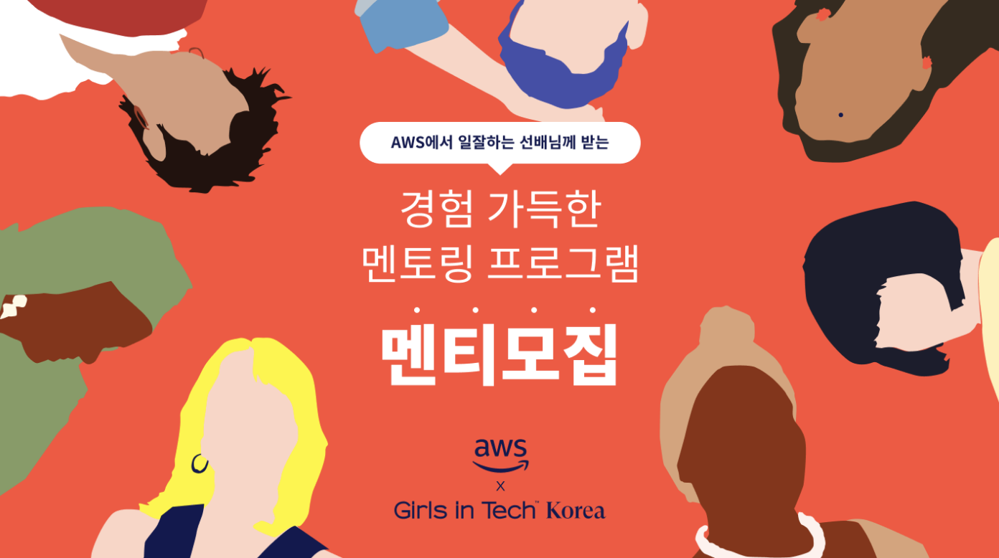
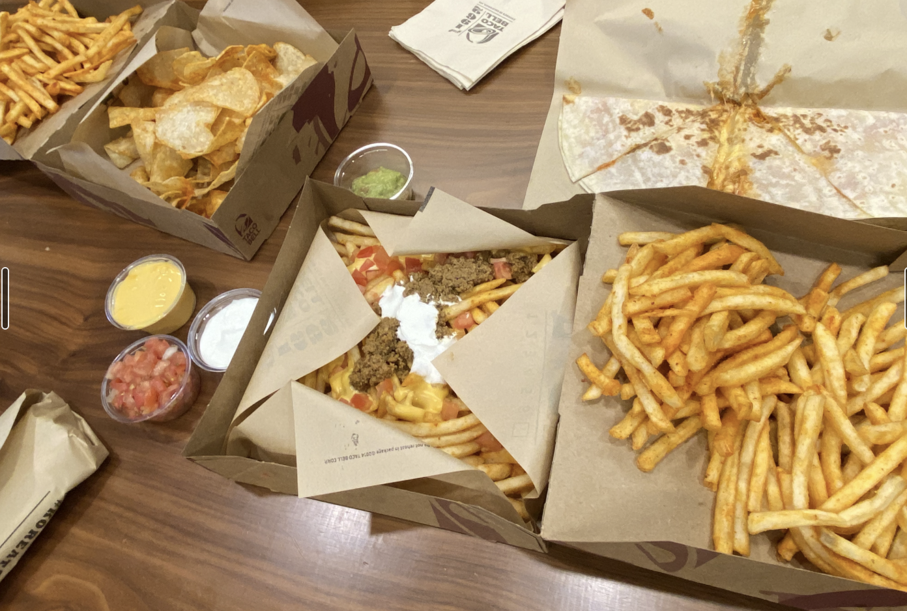

## 개요

최근 이직을 결심하면서 커리어 패스에 대한 고민이 부쩍 늘어났다.
운좋게도(?) 컴퓨터 전공 출신이라 비슷한 고민을 하는 또래 개발자들은 많았다.
하지만 그들과 대화를 했을 때 특별한 인사이트를 얻기 보다는 ~~하소연에 가까운 이야기~~를 반복해서 하는 것 뿐 실질적으로 고민 해결에 도움이 되지는 않았다.

이런 생각이 몇 개월 간 이어지다보니 10년 이상 현업에서 몸을 담고 계시는 분들이라면 내가 지금 하는 고민을 이미 몇년 전 해보셨을테고 그때 잘 헤쳐나가셨으니 여전히 개발자로서 커리어를 잘 쌓아가고 계시지 않을까하는 생각을 했었다.
하지만 사적으로 연락하는 시니어 개발자가 없었고 있다하더라도 개인적인 고민을 털어놓기가 쉽지 않을 것 같았다 🥲

플러스엑스를 퇴사할 무렵에 우연히 **[Girls in Tech X AWS 멘토링 프로그램](https://www.notion.so/Girls-in-Tech-X-AWS-Mentoring-Program-bb254ba32b524347b4c6347b887a4406)** 페이지를 보게 되었다.
시니어 개발자와의 무료 멘토링 프로그램이라는 주제도 너무나 매력적이었지만 개발자라면 모두가 아는 AWS의 개발자 분과의 멘토링이라니! 신청을 안할래야 안할 수 없었다.
경쟁률이 상당했다고 들었는데 다행히도 멘티로서 프로그램을 함께 할 수 있었고 이를 통해 정말 좋은 분들을 만나뵙게 되었다.

## 5주간의 멘토링 회고

Girls In Tech에서 주최하기도 했고 멘티 목록을 보니 여성분들이 꽤 계시는 것 같아 *나와 같은 여성 개발자분들도 만날 수 있지 않을까?* 하는 생각을 했지만 예상 외로 배정된 팀의 멘토와 나머지 멘티분들이 모두 남성분이셨다.
하지만 이 팀에 배정해주신 GIT 측에 정말 감사드린다. 멘토님은 물론 멘티님들도 정말 좋은 분들이셨다! 👍

멘토링은 주 2회 1시간 가량 유연한 스케줄로 진행되었다.
초반에는 Zoom으로 미팅을 하다가 이후에는 AWS의 Chime을 통해 화상 미팅을 진행했다.

멘토링 토픽은 자유롭게 정하는 편이었고 그 중 몇 가지는 멘토님께서 플랜을 제안해주셨다.

- 이력서 검토 및 커리어 패스 그려보기
- AWS SA 기술 인터뷰 질문을 통한 필요 역량 파악하기
- 10년 뒤에도 변하지 않을 것들 생각해보기
- Amazon Leadership Principle 기반의 에세이 작성하기
- 자유로운 주제로 Free Talking

개인적으로 여러 토픽 중 **Amazon Leadership Principle 기반의 에세이**를 작성했던 때가 가장 기억에 남는다.
총 16가지(최근 2가지가 추가되었다고 한다) 원칙에 따라 본인이 겪었던 경험을 기반으로 짧은 에세이를 작성하고 이를 공유하는 시간을 가졌다.

물론 특정 회사의 인재상이기 때문에 100% 만족할 필요도 없고 또 완벽하게 만족하는 사람도 없다고 생각하지만, 시대를 선도하는 IT 기업에서 추구하는 원칙으로서 시장이 원하는 리더란 무엇인가에 대해 처음으로 깊이 생각해 볼 수 있는 계기가 되었다.
아직은 주니어 개발자라서 리더라는 표현이 어색하게 들릴 수 있지만 *Ownership을 가지고 일을 하는 사람이라면 누구나 리더* 라는 멘토님의 말이 강하게 기억에 남는다.
실제로 에세이를 작성해보니 4가지 원칙(Leaders are Right A Lot, Think Big, Frugality, Success and Scale Bring Board Responsibility ...)에 대해서는 마땅히 떠오르는 경험이 없었고 이를 통해 더 나은 리더가 되려면 어떤 경험을 더 쌓아가야 할지 대강 감이 잡혔다.

이외에도 커리어 패스 그려보기, 기술 인터뷰 질문에 대한 답 생각해보기, 프리 토킹 등 매 주제마다 너무나도 알차고 좋은 시간들을 보냈다.
특히 다수를 위한 뻔한 멘토링이 아니어서 더 마음에 와닿았던 것 같다.

공식적인 멘토링은 끝이 났지만 추후 코로나가 잠잠해지면 오프라인 모임을 한번 더 하기로 했다! (야호)

마지막 오프라인 모임에서 멘토님이 사오셨던 타코벨로 글을 마무리한다.
