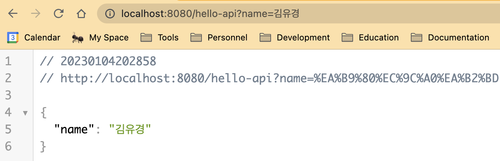

Spring에서 Controller 작성 시 `@RequestParam`과 `@ResponseBody` 어노테이션을 사용하곤 하는데, 각 어노테이션을 사용하는 이유와 동작 과정에 대해 알아보자.

## @RequestParam

QueryString으로 받을 Parameter를 정의하는 어노테이션이다.

```java
public @interface RequestParam {

	@AliasFor("name")
	String value() default "";

	@AliasFor("value")
	String name() default "";

	boolean required() default true;

	String defaultValue() default ValueConstants.DEFAULT_NONE;

}
```

`hello-string` 엔드포인트에서 `name`을 인자로 받고 싶다면 다음과 같이 작성해 주면 된다.

필수 요구사항이 아니라면 `required=false`를 추가해준다.

```java
@GetMapping("hello-string")
@ResponseBody
public String helloString(@RequestParam("name") String name) {
    return "hello " + name;
}
```


`@RequestParam` 어노테이션을 작성하지 않으면 어떻게 될까?

```java
@GetMapping("hello-string")
@ResponseBody
public String helloString(String name) {
    return "hello " + name;
}
```

`RequestParamMethodArgumentResolver`의 `createNameValueInfo` 함수를 확인해보면 `RequestParam` 어노테이션 존재 여부를 확인한 후 없으면 생성해준다.

```java
package org.springframework.web.method.annotation;
...

public class RequestParamMethodArgumentResolver extends AbstractNamedValueMethodArgumentResolver
		implements UriComponentsContributor {

	...

	@Override
	protected NamedValueInfo createNamedValueInfo(MethodParameter parameter) {
		RequestParam ann = parameter.getParameterAnnotation(RequestParam.class);
		return (ann != null ? new RequestParamNamedValueInfo(ann) : new RequestParamNamedValueInfo());
	}

	...

}
```

하지만 어노테이션을 작성하지 않아 생성된 `RequestParamNamedValueInfo` 객체는 `required=false`가 기본값이다.

```java
private static class RequestParamNamedValueInfo extends NamedValueInfo {

		public RequestParamNamedValueInfo() {
			super("", false, ValueConstants.DEFAULT_NONE);
		}

		public RequestParamNamedValueInfo(RequestParam annotation) {
			super(annotation.name(), annotation.required(), annotation.defaultValue());
		}
	}
```

## @ResponseBody

Spring 객체를 다양한 응답 형식으로 변환하여 반환해주는 어노테이션이다.

다음과 같이 `Hello` 객체를 반환하는 API를 작성하여 호출해보면, json 형식으로 변환되어 보이는 것을 확인할 수 있다.

```java
@GetMapping("hello-api")
@ResponseBody
public Hello helloApi(@RequestParam("name") String name) {
    Hello hello = new Hello();
    hello.setName(name);
    return hello;
}

static class Hello {
    private String name;

    public String getName() {
        return name;
    }

    public void setName(String name) {
        this.name = name;
    }
}
```



`@ResponseBody` 어노테이션을 붙이지 않으면 템플릿 파일 자체를 반환하는 것으로 간주하므로, 실행 시 Template이 없거나 Template Resolver가 접근할 수 없다는 에러가 발생한다.

```bash
Exception processing template "hello-api": Error resolving template [hello-api], template might not exist or might not be accessible by any of the configured Template Resolvers
```

그렇다면 json은 객체로, 객체는 json으로 변환해주는 부분은 어디일까?

spring-web의 springframework/http/converter 하위에 존재하는 인터페이스인 `HttpMessageConverter`는 HTTP request와 response를 각각 객체와 응답 메시지로 변환해주는 동작을 한다.

```java
public interface HttpMessageConverter<T> {

	boolean canRead(Class<?> clazz, @Nullable MediaType mediaType);

	boolean canWrite(Class<?> clazz, @Nullable MediaType mediaType);

	List<MediaType> getSupportedMediaTypes();

	default List<MediaType> getSupportedMediaTypes(Class<?> clazz) {
		return (canRead(clazz, null) || canWrite(clazz, null) ?
				getSupportedMediaTypes() : Collections.emptyList());
	}

	T read(Class<? extends T> clazz, HttpInputMessage inputMessage)
			throws IOException, HttpMessageNotReadableException;

	void write(T t, @Nullable MediaType contentType, HttpOutputMessage outputMessage)
			throws IOException, HttpMessageNotWritableException;

}
```

`canRead`, `canWrite` 함수에서 주어진 객체를 컨버터가 읽거나 쓸 수 있는지 확인하고 return값이 `True`인 경우 `read`, `write`에서 변환 작업을 실행한다.

`HttpMessageConverter` 인터페이스를 통해 구현된 여러 Converter들 중 `AbstractJackson2HttpMessageConverter`에서 변환 과정을 자세히 확인할 수 있다.

```java
public abstract class AbstractJackson2HttpMessageConverter extends AbstractGenericHttpMessageConverter<Object> {
		...
}
```
